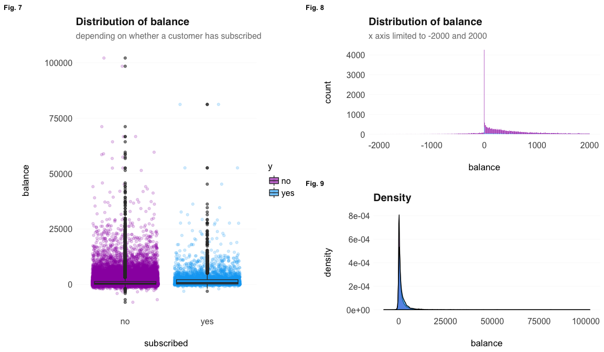
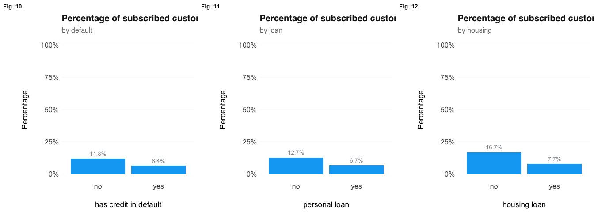
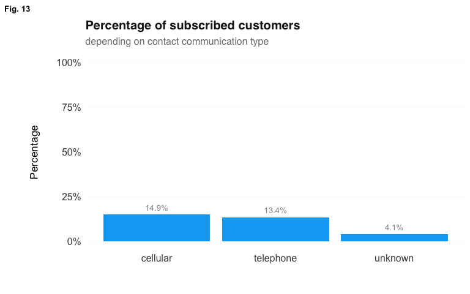
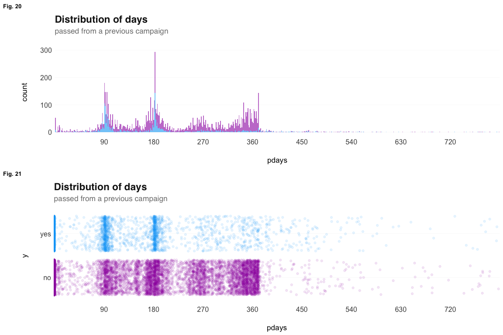
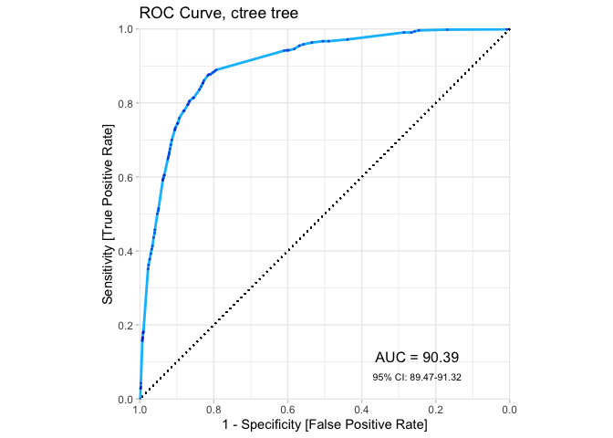
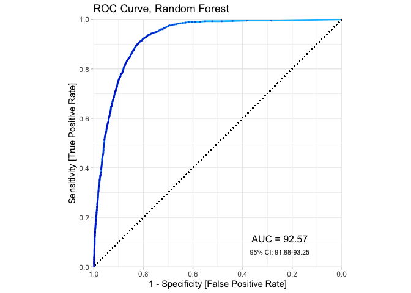
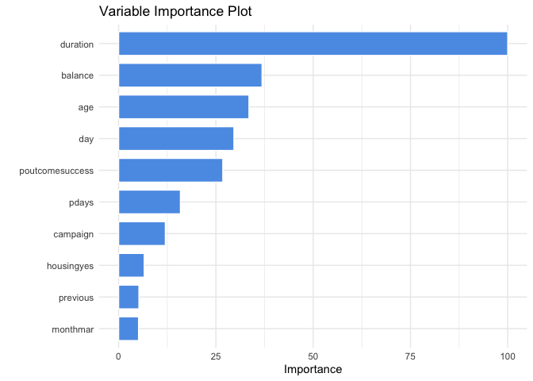
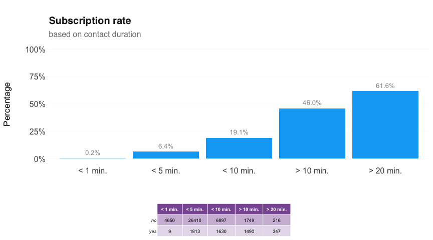
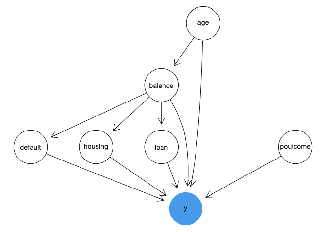

# **Business Analytics / Final / task 1**
*author: Ekaterina Skriptsova*  
*date: 2019-12-21*  


# **introduction**

The aim of this work is to examine the dataset about the direct phone call marketing campaigns, which aimed to promote term deposits among existing customers by a Portuguese bank from May 2008 to November 2010 [[1]](https://archive.ics.uci.edu/ml/datasets/Bank+Marketing), and do the following:  

> - explain the current situation with subscription rate  
> - create a predictive model (whether a client will subscribe a term deposit)
> - suggest policy for subscription rate increase, and analyze it using the what-if modeling  


In the first section, exploratory data analysis, I describe the current situation with subscription rate and identify possible predictors for client subscribing a term deposit. Next one focuses on several predictive models (two decision trees & random forest), comparing their performance, identifying the most important features, and then applying the best model to 6 randomly selected cases in order to analyze when model makes a correct prediction and when it is mistaken. After that, I constuct a Bayesian Network summarizing the hypotheses proposed in the previous sections and propose a policy for improvement.

***


# **exploratory data analysis**

What is a term deposit by the way?

> A term deposit is a fixed-term investment that includes the deposit of money into an account at a financial institution. Term deposit investments usually carry short-term maturities ranging from one month to a few years and will have varying levels of required minimum deposits.[[2]](https://www.investopedia.com/terms/t/termdeposit.asp)

In more plain words, a client locks his/her money for a certain period, and the bank pays them an interest rate. These money can be used by the bank for various purposes, including lending money to other clients [[3]](https://www.investopedia.com/terms/t/termdeposit.asp). Thus, it is highly important to make customers subscribe for such offers so that the bank will have sufficient amount of capital.


## first steps

### preps

The very first step is to upload the packages & dataset. Then - describe the data.


### data description 

The dataset contains 17 variables, that provide the following information about each customer:

(1) socio-demographic  
(2) bank-account related    
(3) campaign related   


The table presents the name of the variable, the category it falls into and the description.


<table class="table table-striped table-hover table-condensed table-responsive" style="margin-left: auto; margin-right: auto;">
 <thead>
  <tr>
   <th style="text-align:left;"> variable </th>
   <th style="text-align:left;"> group </th>
   <th style="text-align:left;"> meaning </th>
  </tr>
 </thead>
<tbody>
  <tr>
   <td style="text-align:left;"> age </td>
   <td style="text-align:left;"> <span style="     color: #410093 !important;">socio-dem.</span> </td>
   <td style="text-align:left;"> customer age </td>
  </tr>
  <tr>
   <td style="text-align:left;"> job </td>
   <td style="text-align:left;"> <span style="     color: #410093 !important;">socio-dem.</span> </td>
   <td style="text-align:left;"> type of job </td>
  </tr>
  <tr>
   <td style="text-align:left;"> marital </td>
   <td style="text-align:left;"> <span style="     color: #410093 !important;">socio-dem.</span> </td>
   <td style="text-align:left;"> marital status </td>
  </tr>
  <tr>
   <td style="text-align:left;"> education </td>
   <td style="text-align:left;"> <span style="     color: #410093 !important;">socio-dem.</span> </td>
   <td style="text-align:left;"> education level </td>
  </tr>
  <tr>
   <td style="text-align:left;"> default </td>
   <td style="text-align:left;"> <span style="     color: #0077B5 !important;">account</span> </td>
   <td style="text-align:left;"> has credit in default </td>
  </tr>
  <tr>
   <td style="text-align:left;"> balance </td>
   <td style="text-align:left;"> <span style="     color: #0077B5 !important;">account</span> </td>
   <td style="text-align:left;"> balance level </td>
  </tr>
  <tr>
   <td style="text-align:left;"> housing </td>
   <td style="text-align:left;"> <span style="     color: #0077B5 !important;">account</span> </td>
   <td style="text-align:left;"> has housing loan </td>
  </tr>
  <tr>
   <td style="text-align:left;"> loan </td>
   <td style="text-align:left;"> <span style="     color: #0077B5 !important;">account</span> </td>
   <td style="text-align:left;"> has personal loan </td>
  </tr>
  <tr>
   <td style="text-align:left;"> contact </td>
   <td style="text-align:left;"> <span style="     color: #ea4c89 !important;">campaign</span> </td>
   <td style="text-align:left;"> contact communication type </td>
  </tr>
  <tr>
   <td style="text-align:left;"> day </td>
   <td style="text-align:left;"> <span style="     color: #ea4c89 !important;">campaign</span> </td>
   <td style="text-align:left;"> last contact day of the week </td>
  </tr>
  <tr>
   <td style="text-align:left;"> month </td>
   <td style="text-align:left;"> <span style="     color: #ea4c89 !important;">campaign</span> </td>
   <td style="text-align:left;"> last contact month of year </td>
  </tr>
  <tr>
   <td style="text-align:left;"> duration </td>
   <td style="text-align:left;"> <span style="     color: #ea4c89 !important;">campaign</span> </td>
   <td style="text-align:left;"> last contact duration, in seconds </td>
  </tr>
  <tr>
   <td style="text-align:left;"> campaign </td>
   <td style="text-align:left;"> <span style="     color: #ea4c89 !important;">campaign</span> </td>
   <td style="text-align:left;"> number of contacts performed during this campaign and for this client </td>
  </tr>
  <tr>
   <td style="text-align:left;"> pdays </td>
   <td style="text-align:left;"> <span style="     color: #ea4c89 !important;">campaign</span> </td>
   <td style="text-align:left;"> number of days that passed by after the client was last contacted from a previous campaign </td>
  </tr>
  <tr>
   <td style="text-align:left;"> previous </td>
   <td style="text-align:left;"> <span style="     color: #ea4c89 !important;">campaign</span> </td>
   <td style="text-align:left;"> number of contacts performed before this campaign and for this client </td>
  </tr>
  <tr>
   <td style="text-align:left;"> poutcome </td>
   <td style="text-align:left;"> <span style="     color: #ea4c89 !important;">campaign</span> </td>
   <td style="text-align:left;"> outcome of the previous marketing campaign </td>
  </tr>
  <tr>
   <td style="text-align:left;"> y </td>
   <td style="text-align:left;"> <span style="     color: #34465d !important;">target</span> </td>
   <td style="text-align:left;"> has the client subscribed a term deposit </td>
  </tr>
</tbody>
</table>


According to the output, the variables are parsed either as `character` or `numeric`, and this is actually not correct: some of them represent categorical ones. I fix that by transforming such columns to factors (next step).

- `job`  
- `marital`  
- `education`  
- `default`  
- `housing`  
- `loan`  
- `contact`  
- `month`  
- `poutcome`  


```
## Classes 'spec_tbl_df', 'tbl_df', 'tbl' and 'data.frame':	45211 obs. of  17 variables:
##  $ age      : num  58 44 33 47 33 35 28 42 58 43 ...
##  $ job      : chr  "management" "technician" "entrepreneur" "blue-collar" ...
##  $ marital  : chr  "married" "single" "married" "married" ...
##  $ education: chr  "tertiary" "secondary" "secondary" "unknown" ...
##  $ default  : chr  "no" "no" "no" "no" ...
##  $ balance  : num  2143 29 2 1506 1 ...
##  $ housing  : chr  "yes" "yes" "yes" "yes" ...
##  $ loan     : chr  "no" "no" "yes" "no" ...
##  $ contact  : chr  "unknown" "unknown" "unknown" "unknown" ...
##  $ day      : num  5 5 5 5 5 5 5 5 5 5 ...
##  $ month    : chr  "may" "may" "may" "may" ...
##  $ duration : num  261 151 76 92 198 139 217 380 50 55 ...
##  $ campaign : num  1 1 1 1 1 1 1 1 1 1 ...
##  $ pdays    : num  -1 -1 -1 -1 -1 -1 -1 -1 -1 -1 ...
##  $ previous : num  0 0 0 0 0 0 0 0 0 0 ...
##  $ poutcome : chr  "unknown" "unknown" "unknown" "unknown" ...
##  $ y        : Factor w/ 2 levels "no","yes": 1 1 1 1 1 1 1 1 1 1 ...
```


The following output shows the report of a data frame, including the basic statistics for each column.  
Some first small highlights:  

- 5289 agreed for a term deposit, 39922 did not  
- clients have both negative and very high `balance`   
- `pdays` - number of days that passed by after the client was last contacted from a previous campaign - has negative value (-1), probably this is the encoding for those who were contacted for the 1st time  
- the `age` range is quite big, covering clients from 18 to even 95 years old    
- for the majority of clients the outcome of the previous marketing campaign is unknown    
- mean call duration - 258 seconds = ~ 4 minutes


```
## The data contains 45211 observations of the following variables:
##   - age: Mean = 40.94, SD = 10.62, range = [18, 95], 0% missing
##   - job: 12 levels: admin. (n = 5171); blue-collar (n = 9732); entrepreneur (n = 1487); housemaid (n = 1240); management (n = 9458); retired (n = 2264); self-employed (n = 1579); services (n = 4154); student (n = 938); technician (n = 7597); unemployed (n = 1303) and unknown (n = 288)
##   - marital: 3 levels: divorced (n = 5207); married (n = 27214) and single (n = 12790)
##   - education: 4 levels: primary (n = 6851); secondary (n = 23202); tertiary (n = 13301) and unknown (n = 1857)
##   - default: 2 levels: no (n = 44396) and yes (n = 815)
##   - balance: Mean = 1362.27, SD = 3044.77, range = [-8019, 102127], 0% missing
##   - housing: 2 levels: no (n = 20081) and yes (n = 25130)
##   - loan: 2 levels: no (n = 37967) and yes (n = 7244)
##   - contact: 3 levels: cellular (n = 29285); telephone (n = 2906) and unknown (n = 13020)
##   - day: Mean = 15.81, SD = 8.32, range = [1, 31], 0% missing
##   - month: 12 levels: apr (n = 2932); aug (n = 6247); dec (n = 214); feb (n = 2649); jan (n = 1403); jul (n = 6895); jun (n = 5341); mar (n = 477); may (n = 13766); nov (n = 3970); oct (n = 738) and sep (n = 579)
##   - duration: Mean = 258.16, SD = 257.53, range = [0, 4918], 0% missing
##   - campaign: Mean = 2.76, SD = 3.10, range = [1, 63], 0% missing
##   - pdays: Mean = 40.20, SD = 100.13, range = [-1, 871], 0% missing
##   - previous: Mean = 0.58, SD = 2.30, range = [0, 275], 0% missing
##   - poutcome: 4 levels: failure (n = 4901); other (n = 1840); success (n = 1511) and unknown (n = 36959)
##   - y: 2 levels: no (n = 39922) and yes (n = 5289)
```


## plots, plots, plots

Now, as the data types are assigned properly, it's time for the visualizations!   

Firstly, I begin with the distribution of the most important variable - overall subscription rate (`y`), and then proceed with the description of socio-demographic variables, account-related and campaign-related ones. Then, summarize the main findings that are further used for the (1) model building and (2) Bayesian network stages.

### subscription rate / target

What is the subscription rate of term deposits among the existing customers? According to the plot,   

> ~12% of clients have agreed for a term deposit.

<!-- -->

Let's move to the next variables and see in which terms the subscribed clients differ from those who did not.


### socio-demographics

The socio-demographic features are examined on the following Fig.2-4, depending on whether customer has subscribed. 

- **Job**: the subscription rate was the highest among students & retired guys, and the lowest for blue-collars  
- **marital**: among representatives of different marital statuses, the subscription rate is the highest for the single ones   
- **education**: as for education, percentage of subscribed customers is higher among those with tertiary level, and the lowest for clients with primary


<!-- -->

#### age 

Here you can see a half-violin half-dot plot (Fig. 5) showing the distribution and the sample size of `age`.   

- The right side shows the distribution's shape: the one for "subscribed" category has a longer tail of more "older" clients, and for both distributions the median is around 38-39 years old (shown by horizontal lines, blue - subscribed, purple - declined). Also, both of them cover the entire age range of clients, from 18 to 95.   
- The left side of the figures shows the sample size. As expected and shown in previous steps, the majority of clients did not subscribe a term deposit. Also, it is noticeable that most not-subscribed clients were aged 25-60 (confirmed by table near Fig. 6). 

I further cut age into 6 age groups and calculated the subscription rate within them. As shown on the Fig. 6 & in the table, the highest rate was in the 65-100 (95) age group, followed by 18-25. This is quite consistent with Fig. 2, where the most subscribed were students and retired people.

<!-- -->

<table class="table table-striped table-hover table-condensed table-responsive" style="margin-left: auto; margin-right: auto;">
 <thead>
  <tr>
   <th style="text-align:left;"> y </th>
   <th style="text-align:right;"> length </th>
   <th style="text-align:right;"> min </th>
   <th style="text-align:right;"> max </th>
   <th style="text-align:right;"> mean </th>
   <th style="text-align:right;"> sd </th>
  </tr>
 </thead>
<tbody>
  <tr>
   <td style="text-align:left;"> no </td>
   <td style="text-align:right;"> 39922 </td>
   <td style="text-align:right;"> 18 </td>
   <td style="text-align:right;"> 95 </td>
   <td style="text-align:right;"> 40.83899 </td>
   <td style="text-align:right;"> 10.17266 </td>
  </tr>
  <tr>
   <td style="text-align:left;"> yes </td>
   <td style="text-align:right;"> 5289 </td>
   <td style="text-align:right;"> 18 </td>
   <td style="text-align:right;"> 95 </td>
   <td style="text-align:right;"> 41.67007 </td>
   <td style="text-align:right;"> 13.49778 </td>
  </tr>
</tbody>
</table>


### account

Now let's move to the account-related attributes: `balance`, `default`, `housing`, `loan`.

#### balance

So, probably `balance` may influence the decision for subscribing a term deposit? *(as a person needs to have some money for investment)* 

As shown on the next Fig. 7-9, most clients who subscribed a deposit have rather positive `balance` level, and both mean & median values are higher for this group.

<!-- -->


```r
desc_statby(df, measure.var = "balance", grps = "y")[, c("y", "length", "min", "max" ,"mean", "median", "sd")] %>% 
  kable(format = "html", escape = F) %>% 
  kable_styling(bootstrap_options = c("striped", "hover", "condensed", "responsive"))
```

<table class="table table-striped table-hover table-condensed table-responsive" style="margin-left: auto; margin-right: auto;">
 <thead>
  <tr>
   <th style="text-align:left;"> y </th>
   <th style="text-align:right;"> length </th>
   <th style="text-align:right;"> min </th>
   <th style="text-align:right;"> max </th>
   <th style="text-align:right;"> mean </th>
   <th style="text-align:right;"> median </th>
   <th style="text-align:right;"> sd </th>
  </tr>
 </thead>
<tbody>
  <tr>
   <td style="text-align:left;"> no </td>
   <td style="text-align:right;"> 39922 </td>
   <td style="text-align:right;"> -8019 </td>
   <td style="text-align:right;"> 102127 </td>
   <td style="text-align:right;"> 1303.715 </td>
   <td style="text-align:right;"> 417 </td>
   <td style="text-align:right;"> 2974.195 </td>
  </tr>
  <tr>
   <td style="text-align:left;"> yes </td>
   <td style="text-align:right;"> 5289 </td>
   <td style="text-align:right;"> -3058 </td>
   <td style="text-align:right;"> 81204 </td>
   <td style="text-align:right;"> 1804.268 </td>
   <td style="text-align:right;"> 733 </td>
   <td style="text-align:right;"> 3501.105 </td>
  </tr>
</tbody>
</table>

#### default, loan, housing

Next three are:  

- `default` has credit in default
- `housing` has housing loan
- `loan` has personal loan

Simple conclusion for Fig. 10-12: rates are higher among those who have no default, no personal and no housing loan. Probably it happens because they do not owe money for the bank and have more to invest. 


<!-- -->


### contact, duration, campaign


- `contact` - contact communication type *(cellular (n = 29285); telephone (n = 2906) and unknown (n = 13020))*   
- `duration` - last contact duration, in seconds *(Mean = 258.16, SD = 257.5, range = [0, 4918])*  


So, the clients were contacted mostly by cellular (n = 29285), another 2906 - by telephone. For the rest 13020 clients the `contact` communication type is unknown. 

<!-- -->

The median `duration` of last contact for subscribers was 7 minutes, while for others - between 2 and 3. What is interesting: for someone it took just 8 seconds to subscribe!


<table class="table table-striped table-hover table-condensed table-responsive" style="margin-left: auto; margin-right: auto;">
 <thead>
  <tr>
   <th style="text-align:left;"> y </th>
   <th style="text-align:right;"> length </th>
   <th style="text-align:right;"> min </th>
   <th style="text-align:right;"> max </th>
   <th style="text-align:right;"> mean </th>
   <th style="text-align:right;"> median </th>
   <th style="text-align:right;"> sd </th>
  </tr>
 </thead>
<tbody>
  <tr>
   <td style="text-align:left;"> no </td>
   <td style="text-align:right;"> 39922 </td>
   <td style="text-align:right;"> 0 </td>
   <td style="text-align:right;"> 4918 </td>
   <td style="text-align:right;"> 221.1828 </td>
   <td style="text-align:right;"> 164 </td>
   <td style="text-align:right;"> 207.3832 </td>
  </tr>
  <tr>
   <td style="text-align:left;"> yes </td>
   <td style="text-align:right;"> 5289 </td>
   <td style="text-align:right;"> 8 </td>
   <td style="text-align:right;"> 3881 </td>
   <td style="text-align:right;"> 537.2946 </td>
   <td style="text-align:right;"> 426 </td>
   <td style="text-align:right;"> 392.5253 </td>
  </tr>
</tbody>
</table>

            
<!-- -->

During the `campaign` *(Mean = 2.76, SD = 3.10, range = [1, 63])*, most of the clients have been contacted several times, while some - more than 50. Perhaps, such customers had additional questions, or problems, or asked to call back *(e.g. parents aren’t home)*. We’ll never know.    
Fig. 16 shows the subscription rate depending on the number of contacts performed during this campaign and for this client. In general, the % decreases with the increase of number of calls. However, the rate for those who were contacted many-many times *(note: up to 32, not the max. value)* the sub. rate slightly increases. This may happen due to some outlier cases. Table itself shows the information about the `campaign` variable split by `y`.   

At Fig.17 we can finally see some division: clients who were contacted less times had longer conversations and subscribed, so in general the duration of contact was higher for those who agreed. Clients contacted very often had shorter conversations and mostly declined (purple dots at the bottom). **Main point:** do not contact your clients **that** often, otherwise company may be considered as annoying, which in long term may lead to the churn of these customers!


<!-- -->


Well, we also have data on `month` and `day`. Let's take a look at these two! 

- `day` - last contact day of the week  
- `month` - last contact month of year *(apr (n = 2932); aug (n = 6247); dec (n = 214); feb (n = 2649); jan (n = 1403); jul (n = 6895); jun (n = 5341); mar (n = 477); may (n = 13766); nov (n = 3970); oct (n = 738) and sep (n = 579))*  

The highest subscription rate happened in March (Spring) and in September, October and December, the lowest - in Summer. No explainable pattern is observed for `day`, however, seems like most agree in the beginning & close to end of the month; wish we had data on year to detect weekday! *(perhaps, people have slightly more time on holidays)*


<!-- -->


#### pdays, previous, poutcome 

- `pdays` - number of days that passed by after the client was last contacted from a previous campaign (Mean = 40.20, SD = 100.13, range = [-1, 871])    


The most frequent value for `pdays` is "-1", which is a bit strange as how a number of days may be negative? Guess it is the encoding for those customers who were not contacted at all. Others were contacted ~90 and ~180 days ago.


<table class="table table-striped table-hover table-condensed table-responsive" style="width: auto !important; margin-left: auto; margin-right: auto;">
 <thead>
  <tr>
   <th style="text-align:left;"> pdays </th>
   <th style="text-align:right;"> n </th>
  </tr>
 </thead>
<tbody>
  <tr>
   <td style="text-align:left;"> -1 </td>
   <td style="text-align:right;"> 36954 </td>
  </tr>
  <tr>
   <td style="text-align:left;"> 182 </td>
   <td style="text-align:right;"> 167 </td>
  </tr>
  <tr>
   <td style="text-align:left;"> 92 </td>
   <td style="text-align:right;"> 147 </td>
  </tr>
  <tr>
   <td style="text-align:left;"> 91 </td>
   <td style="text-align:right;"> 126 </td>
  </tr>
  <tr>
   <td style="text-align:left;"> 183 </td>
   <td style="text-align:right;"> 126 </td>
  </tr>
  <tr>
   <td style="text-align:left;"> 181 </td>
   <td style="text-align:right;"> 117 </td>
  </tr>
</tbody>
</table>

From the following plots, we can detect some sort of "seasonality" in terms of number of days passed from the last contact during a previous campaign. Seems like the previous campaigns were performed every 90 days (2-3 months) as the peaks are located at 90, 180, etc. days *(note: -1 is excluded from the Fig. 20)*.  
It is also noticeable that a year ago a very small number of customers was reached. 

<!-- -->

- `previous` - number of contacts performed before this campaign and for this client (Mean = 0.58, SD = 2.30, range = [0, 275])      
- `poutcome` - outcome of the previous marketing campaign    
  - failure (n = 4901);   
  - other (n = 1840);    
  - success (n = 1511);   
  - unknown (n = 36959)        

As for the number of previous contacts, most of the clients were contacted 0 times, meaning that this is the first time they have been called.     
The percentage of subscribed clients was the highest among those for whom the outcome of `previous` campaign was successfu: 64.7%! Perhaps, the campaign was similar, and the customers were satisfied with the service, thus, decided to continue. 

<!-- -->


***

#### summing up

That's it for the plots. So, what are the **main findings**?  

- the subscription rate is 12%   
- it's higher for young and old clients, students and retired people    
- better not to call too many times!  
- clients with no loans are more likely to subscribe a term deposit  
- higher balance -- higher chance to subscribe as well

***

# **models**

In this section, I create two decision trees and a random forest. Then compare their performance based on various metrics, identify most important variables, and provide interpretation for several correctly and incorrectly predicted cases. After that, I move to the Bayesian networks section, where the main findings are summarized and tested. 


## decision tree

Here I employ two methods of creating decision trees, which are supported by `caret` package. These are `ctree` and `rpart`. In sum, the first one performs better than the second, which seemed a bit odd in the beginning. By looking closer at the output, it is noticeable that the accuracy for both models is very-very similar. However, the recall score of the 1st model is higher, as well as the ROC-AUC.   
I googled a bit and found that they represent implementations of different algorithms, which makes the difference in scores quite explainable. Thus, as the metrics are higher for `ctree`, I can conclude that this method performs better on the provided data, and this model is the best one among the provided two. [[3]](https://stats.stackexchange.com/questions/12140/conditional-inference-trees-vs-traditional-decision-trees)


### decision tree (ctree)

Set up:

- metric to optimize - ROC, as we have imbalanced classes   
- 5 fold cross-validation    
- one tree   


As we have 88% of non-subscribed users, the baseline accuracy should be $\geq 88%$.    


```
## Conditional Inference Tree 
## 
## 36170 samples
##    16 predictor
##     2 classes: 'no', 'yes' 
## 
## No pre-processing
## Resampling: Cross-Validated (5 fold) 
## Summary of sample sizes: 28937, 28935, 28935, 28937, 28936 
## Resampling results across tuning parameters:
## 
##   mincriterion  ROC        Sens       Spec     
##   0.01          0.8827731  0.9561025  0.4692817
##   0.50          0.8956743  0.9614564  0.4650353
##   0.99          0.8974755  0.9609553  0.4629263
## 
## ROC was used to select the optimal model using the largest value.
## The final value used for the model was mincriterion = 0.99.
```


```r
#plot(one_tree$finalModel, type="simple")
```


Performance on **train**:  

- Accuracy = 91% -  the model correctly predicted 91% of the cases, which is higher than the baseline  
- Precision = 64% - the ratio of correctly predicted "subscribed" to the total number of predicted as "subscribed" -> 64% of "subscribed" predictions are correct    
- Recall = 45%  - the model managed to identify 45% of those subscribed a term deposit   


```
## Confusion Matrix and Statistics
## 
##           Reference
## Prediction    no   yes
##        no  30852  2308
##        yes  1086  1924
##                                           
##                Accuracy : 0.9062          
##                  95% CI : (0.9031, 0.9092)
##     No Information Rate : 0.883           
##     P-Value [Acc > NIR] : < 2.2e-16       
##                                           
##                   Kappa : 0.4809          
##                                           
##  Mcnemar's Test P-Value : < 2.2e-16       
##                                           
##               Precision : 0.63920         
##                  Recall : 0.45463         
##                      F1 : 0.53134         
##              Prevalence : 0.11700         
##          Detection Rate : 0.05319         
##    Detection Prevalence : 0.08322         
##       Balanced Accuracy : 0.71031         
##                                           
##        'Positive' Class : yes             
## 
```

More importantly, the performance on **test**:

- Accuracy: 90% correctly predicted cases, very close to the accuracy on train, which is good *(likely no overfitting)*   
- Precision: 61% predicted as "subscribed" actually subscribed   
- Recall: identified 44% of real subscribers   


```
## Confusion Matrix and Statistics
## 
##           Reference
## Prediction   no  yes
##        no  7687  596
##        yes  297  461
##                                           
##                Accuracy : 0.9012          
##                  95% CI : (0.8949, 0.9073)
##     No Information Rate : 0.8831          
##     P-Value [Acc > NIR] : 2.178e-08       
##                                           
##                   Kappa : 0.4547          
##                                           
##  Mcnemar's Test P-Value : < 2.2e-16       
##                                           
##               Precision : 0.60818         
##                  Recall : 0.43614         
##                      F1 : 0.50799         
##              Prevalence : 0.11691         
##          Detection Rate : 0.05099         
##    Detection Prevalence : 0.08384         
##       Balanced Accuracy : 0.69947         
##                                           
##        'Positive' Class : yes             
## 
```

And the main metric based on which I'm going to compare the models is ROC-AUC, which shows how well does the model distinguish one class from another. Higher the AUC *(and line closer to the left upper corner)*, the better is the model: perfect classifier has an AUC of 1, while 0.5 - no class separation capacity. Here it equals **90.39%**, which is quite good!


```
## Area under the curve: 0.9039
```

<!-- -->


While making decision, the most important factors for the tree were`duration`, `contact`, `housing`. The least: `month`, `day`, `age` and `default`. 

<!-- -->


***

### decision tree (rpart)

Another way of creating a tree is to use `rpart`. Again:

- Optimize ROC  
- 5-fold cross-validation  


```
## CART 
## 
## 36170 samples
##    16 predictor
##     2 classes: 'no', 'yes' 
## 
## No pre-processing
## Resampling: Cross-Validated (5 fold) 
## Summary of sample sizes: 28937, 28935, 28935, 28937, 28936 
## Resampling results across tuning parameters:
## 
##   cp          ROC        Sens       Spec     
##   0.02244802  0.7526214  0.9737930  0.3237202
##   0.02481096  0.7518272  0.9700356  0.3355364
##   0.03386894  0.6994867  0.9739805  0.2754843
## 
## ROC was used to select the optimal model using the largest value.
## The final value used for the model was cp = 0.02244802.
```


Here comes an interesting thing. The accuracy and precision are quite similar to the `ctree` - 89% and 62% respectively. However, the recall on **train** is 0.32, which is definitely lower than 0.45. 


```
## Confusion Matrix and Statistics
## 
##           Reference
## Prediction    no   yes
##        no  31091  2850
##        yes   847  1382
##                                           
##                Accuracy : 0.8978          
##                  95% CI : (0.8946, 0.9009)
##     No Information Rate : 0.883           
##     P-Value [Acc > NIR] : < 2.2e-16       
##                                           
##                   Kappa : 0.3775          
##                                           
##  Mcnemar's Test P-Value : < 2.2e-16       
##                                           
##               Precision : 0.62001         
##                  Recall : 0.32656         
##                      F1 : 0.42780         
##              Prevalence : 0.11700         
##          Detection Rate : 0.03821         
##    Detection Prevalence : 0.06163         
##       Balanced Accuracy : 0.65002         
##                                           
##        'Positive' Class : yes             
## 
```


On the **test** set the model performs in the same way - accuracy of 90% and 65% precision. But the percentage of correctly identified "subscribers" is just 34, compared to 44 using `ctree`. 


```
## Confusion Matrix and Statistics
## 
##           Reference
## Prediction   no  yes
##        no  7787  695
##        yes  197  362
##                                          
##                Accuracy : 0.9013         
##                  95% CI : (0.895, 0.9074)
##     No Information Rate : 0.8831         
##     P-Value [Acc > NIR] : 1.793e-08      
##                                          
##                   Kappa : 0.3994         
##                                          
##  Mcnemar's Test P-Value : < 2.2e-16      
##                                          
##               Precision : 0.64758        
##                  Recall : 0.34248        
##                      F1 : 0.44802        
##              Prevalence : 0.11691        
##          Detection Rate : 0.04004        
##    Detection Prevalence : 0.06183        
##       Balanced Accuracy : 0.65890        
##                                          
##        'Positive' Class : yes            
## 
```

Oh. And, consequently, AUC is just **76.3**, which looks sad compared to an amazing score of 90.39!  

As a result, the conclusion about decision trees is that a `ctree` model performed better on this data than `rpart`.


```
## Area under the curve: 0.763
```

<!-- -->


The next plot shows the calculated variable importance for this model, which is different, filtering those with higher than 0.0 value. The most important ones are: `poutcome(success)` and `duration`. The least - related to months, days & the rest filtered, e.g. age, marital status other than married, etc. :)

<!-- -->


***

## random forest 🌳🌳

Tree by `ctree` is good, but what if an entire forest is better?

Set up:

- number of trees: 10  
- control: cross-validation, 3-fold   
- be careful: this chunk took ~30 mins to fit (but then i saved the model to load it later -> fast knitting!) 


```r
rf_model_b = readRDS("_rf_model.rds")
rf_model_b
```

```
## Random Forest 
## 
## 36170 samples
##    16 predictor
##     2 classes: 'no', 'yes' 
## 
## No pre-processing
## Resampling: Cross-Validated (3 fold) 
## Summary of sample sizes: 24113, 24114, 24113 
## Resampling results across tuning parameters:
## 
##   mtry  Accuracy   Kappa    
##    2    0.8920100  0.1594414
##   22    0.9061653  0.4893659
##   42    0.9045065  0.4854582
## 
## Accuracy was used to select the optimal model using the largest value.
## The final value used for the model was mtry = 22.
```


The performance on **train** data is super good: accuracy of 1, precision 1, recall 1, what a perfect classifier! 


```
## Confusion Matrix and Statistics
## 
##           Reference
## Prediction    no   yes
##        no  31938     0
##        yes     0  4232
##                                      
##                Accuracy : 1          
##                  95% CI : (0.9999, 1)
##     No Information Rate : 0.883      
##     P-Value [Acc > NIR] : < 2.2e-16  
##                                      
##                   Kappa : 1          
##                                      
##  Mcnemar's Test P-Value : NA         
##                                      
##               Precision : 1.000      
##                  Recall : 1.000      
##                      F1 : 1.000      
##              Prevalence : 0.117      
##          Detection Rate : 0.117      
##    Detection Prevalence : 0.117      
##       Balanced Accuracy : 1.000      
##                                      
##        'Positive' Class : yes        
## 
```


Now, take a closer look at the confusion matrix for **test** data. We have the following:

1. **TP**, subscribed who actually subscribed: 490  
2. **FP**, subscribed who actually declined: 308  
3. **TN**, declined who actually declined: 7676  
4. **FN**, declined who actually subscribed: 567   
5. **Accuracy:** 90% of correctly predicted cases    
6. **Precision:** 61% of predicted as "subscribed" actually "subscribed" *(i.e. most cases predicted as subscribed will actually subscribe)*     
7. **Recall:** 46% of all "subscribed" were detected *(i.e. model identified 46% of those from the "subscribed" class)*  


```
## Confusion Matrix and Statistics
## 
##           Reference
## Prediction   no  yes
##        no  7676  565
##        yes  308  492
##                                           
##                Accuracy : 0.9034          
##                  95% CI : (0.8972, 0.9095)
##     No Information Rate : 0.8831          
##     P-Value [Acc > NIR] : 3.518e-10       
##                                           
##                   Kappa : 0.4772          
##                                           
##  Mcnemar's Test P-Value : < 2.2e-16       
##                                           
##               Precision : 0.61500         
##                  Recall : 0.46547         
##                      F1 : 0.52989         
##              Prevalence : 0.11691         
##          Detection Rate : 0.05442         
##    Detection Prevalence : 0.08849         
##       Balanced Accuracy : 0.71345         
##                                           
##        'Positive' Class : yes             
## 
```

Also, can look at the rates.

```r
tn = cm_rf_test$table[1,1] ; fn = cm_rf_test$table[1,2] ; fp = cm_rf_test$table[2,1] ; tp = cm_rf_test$table[2,2]
tpr = tp/(tp+fn) ; tnr = tn/(tn+fp) ; fpr = fp/(fp+tn) ; fnr = fn/(fn+tp)
```

```
## [1] "TPR: 0.465468"
## [1] "TNR: 0.961423"
## [1] "FPR: 0.038577"
## [1] "FNR: 0.534532"
```


Finally, the **AUC** has increased to **92.57**. Looks like we have a winner here!

> Random Forest model is the best one among the presented ones, based on almost every metric, including the AUC.


```
## Area under the curve: 0.9257
```

<!-- -->


The **most important** variable, again, is `duration`, followed by `balance`, `age`, `day` and `poutcome` (success). This means that a certain duration, balance, age, day of contact and success of previous campaign highly influence the model's decision. Let's go deeper in the next section!

<!-- -->


## interpretation

This section is devoted to explanation of model's individual predictions using `lime` package. 


Here we have three cases where the random forest made the **correct predictions**. In all three, the most important feature was `duration`, but split on different values. Case 2809 was predicted as *not subscribed* because the conversation lasted less than 103 seconds, person was `aged` between 39 and 48, and the outcome of previous campaign was unknown. Though, two features contradicted to the selected label. These are `balance` higher than 1427 and `month (july)`.    

A client 5169 did not subscribe. Why? Well, we did not know the outcome of the previous campaign, he/she was middle aged, had small balance and was contacted in November, in which the overall subscription rate was rather low.  

Another person 9027 subscribed a deposit! The model made this decision because the client previously successfully participated in the campaign, had a good call duration (which was enough to convince the customer). However, he or she had quite a small balance, and this is the variable that contradicts to the prediction of "subscribed" label.

<!-- -->

The main cause for **incorrect predictions** for the 3 selected cases was the `duration` longer than 319 seconds. Also, the wrong label was supported by `month` and `poutcome` features: the unknown result of the previous contact supports the "No" label.  


<!-- -->


***


# **bayesian network**


```r
library(Rgraphviz)
library(gRain)
```

So, it's time to find factors that may increase the clients' chances to subscribe. As shown in the previous sections, top features differed among the presented models. However, the majority of them had `duration`, `balance`, `age`, `poutcome`, `contact`, `day`, `housing` on the list. Other socio-demographic characteristics of customers had zero or little importance.

In order to understand the situation and possible ties more clearly, let's take a step back and specify what is a «term deposit», «personal loan» and «home loan».

1. **Term deposit** – a client locks his/her money for a certain period, and bank pays them a higher rate of interest on savings. The bank can invest the received money or lend to other clients and receive some interest rate from them. In other words, client subscribes for a term deposit, and the bank gets money that can be used for the company’s purposes, e.g. can be lend to other clients. This is an important **source for the bank's profit/capital**, and the institution should maintain balance between rates for term deposits and rates for loans. *(The interest rate – the amount a lender charges for the use of assets expressed as a percentage of the principal)*
2. **Personal loan** –  bank lends money, customer buys something and pays the company later (e.g. for car, school fee)
3. **Home loan** – in Russian - «ipoteka». A person has some money, bank lends the rest, and then a person pays interest on the loan for approx. 20-25 years [[4]](https://www.canstar.com.au/opinions/how-banks-work/), [[5]](https://www.investopedia.com/terms/t/termdeposit.asp)  

Okay, now it's time to proceed to the next sub-section -  preparation of the data. 

### preparation

In order to create the Bayesian networks, numeric variables should be firstly cut into factors. 

**Age** can be simply divided into intervals:

- from 18 to 25  
- 26-35  
- 36-45  
- 46-55  
- 56-65  
- 65+  

It's clear from the plot that the subscription rate among people aged 65+ is the highest (42%), followed by age group 18-25. Clients from the middle age groups paid less attention to the campaign. This means that the bank should further target the youngest and more old age groups, as others showed quite little interest. As can be seen from the table below the plot, the bank mostly contacted people aged from 25-55 groups *(assuming that this is only a part of bank's entire database)*.

<!-- -->


**Balance**: may cut into the following (without creating too many groups..):

- clients with negative balance - perhaps they are less likely to have money that can be put into deposit (<$0)  
- those who have from 0 to median balance (0-$450)  
- those whose balance is above median ($450 - $1400)  
- high balance ($1400 - $10 000)  
- very-very high balance ($10 000 - $100 000)  

The conclusion here is pretty straightforward: clients with higher balance subscribed more than those with low balance. Perhaps, they have some extra money and the interest rate is higher for those who can afford a bigger term deposit. So it's better to focus on clients whose balance is at least not negative, or even better.


```
##    Min. 1st Qu.  Median    Mean 3rd Qu.    Max. 
##   -8019      72     448    1362    1428  102127
```

<!-- -->


**Duration**, split based on the distribution & general knowledge. 

- less than a minute; usually 60 seconds are not enough for processing information and subscribing, so these people likely just said "no" and ended a call    
- during a 5 min. people can process info and think a bit more + bank worker has more time to convince; and we can see an increase of subscription rate on the figure below
- 5-10 min.: seems like 5-10 minutes are enough for both asking more questions and convincing even more; 
- more than 10 minutes and more than 20 min. - a very sufficient amount of time for discussing all the details and subscribing a term deposit; guess people can maintain such a long phone call only if they are interested in the discussion topic; well, 46 & 62% of clients who passed the 10 min. threshold have agreed

This feature was one of the most important for the models. And here comes a short note: actually, `duration` is not a very good variable for the model in real life as the length of a conversation is not known before a call is performed. 

<!-- -->


## first attempt

Firstly, I started with a very simple model based only on four money-related variables. Automatically created structure showed that `default` and `housing` features are connected to `balance`. So, according to the automatic logic, (1) having credit in default and (2) having a housing loan influences client's balance, which seems like truth: `default` means that a client did not have enough money, so it's likely that people with a debt will have lower balance. However, I guess it's more likely that if a customer's `balance` turns negative, then the accout is marked `yes` in `default`, consequently, it should be rather `balance` -> `default` tie.  

As for connections to `y`: the link from `balance` seems correct, while `housing` and `loan` should probably be linked to `y` only through `balance`. Or, for instance, `balance` -> `loan` -> `y` as if a person has a small amount of money, he/she may take a loan & needs money to pay for that (i.e. no/less money for term deposit). Also, the EDA stage showed that subscription rate was higher among those having no `default`, no `loan` and no `housing` loan. 


```r
set.seed(17)
df_bn_first = data.frame(df_bn %>% dplyr::select(housing, loan, default, balance, y)) %>% na.omit()
bnStructure = bnlearn::hc(df_bn_first)
graphviz.plot(bnStructure, highlight = list(nodes="y", fill="#55acee", col="white"))
```

<!-- -->

Furthermore, link between `housing` and `loan` looks not very reliable. Well, I'm not a pro in banking, but previously I went to Google to understand whether such a connection between two loans is valid at all. As understood: 

- **default** - person failed to pay an expected debt  
- **a personal loan** means that the debtor is an individual person   
- **a housing loan** is when a person borrows money to buy a house; 

Then I looked at the data, and some customers with a housing loan did not have a personal loan. Looks like it's better to delete this connection as it becomes too complex to interprete, at least.


```
## # A tibble: 3 x 4
##   default housing loan  y    
##   <fct>   <fct>   <fct> <fct>
## 1 no      yes     no    no   
## 2 no      yes     no    no   
## 3 no      yes     yes   no
```

### add fixes

Now the situation is the following: `balance` can directly influence the decision to subscribe a term deposit as in order to do so, client needs some money. Also, the interest rate may be higher for bigger amounts, so the **conditions** may look more attractive for such clients. It is also is related to `default`, `housing` and `loan`. In case of `default`, having a negative balance mostly means that a client probably has no money to pay for something, e.g. housing loan. However, having a default does not necessary mean that a person has a `loan` or `housing`, as shown in the table below. As far as I know, people usually take loans if they do not have enough money to buy something they want, so, perhaps, if they have lower balance, it's more likely that they will take a loan.   

In sum, here I add ties because `balance` may influence the decision to subscribe a term deposit differently if a person has some loans or debts. 


```r
df_bn %>% dplyr::filter(default=="yes") %>% group_by(default, housing, loan) %>% dplyr::select(default, housing, loan) %>% dplyr::count()
```

```
## # A tibble: 4 x 4
## # Groups:   default, housing, loan [4]
##   default housing loan      n
##   <fct>   <fct>   <fct> <int>
## 1 yes     no      no      212
## 2 yes     no      yes     168
## 3 yes     yes     no      302
## 4 yes     yes     yes     133
```


<!-- -->


### probabilities

Let's calculate probabilities on the data and look what we have here!


```r
net_first = bn.fit(bn, data = data.frame(df_bn %>% dplyr::select(housing, loan, default, balance, y)))
```

So, the probability of subscription based on our small dataset is 11.49%. 

```r
set.seed(17)
cpquery(net_first, event = (y == "yes"), evidence = TRUE)
```

```
## [1] 0.1149
```

What about different segments?   

- having a `loan` decreases the probability of subscription from 0.1176 to 0.068    
- `not` having a `loan` slightly increases it to 0.127  


```
## [1] "P. if a personal has a loan: 0.068140"

## [1] "P. if a personal doesn't have a loan: 0.126588"
```


The probability of subscription decreases to 0.079 if a person has a housing loan, and increases to 0.16 if a client doesn't have it. So, this confirms the suggestion that having loans negatively influences the decision to subscribe a term deposit.


```
## [1] "P. if a personal has a housing loan: 0.078793"

## [1] "P. if a personal doesn't have a housing loan: 0.163017"
```


And what if a person has a default, personal loan and housing loan?    

- for clients with a default and two types of loans the result was dependent on the random seed - sometimes the result was 0, and sometimes 0.07 (due to a small number of observations)   
- for those who did not have it the probability is more stable - approximately 0.18-0.20   

```
## [1] "P. if has: 0.071429"

## [1] "P. if not: 0.182203"
```


### final network

After more thinking and drawing, I came up with the following structure and added more variables that were identified as important during EDA and model building. 


<!-- -->


The model has the following structure: 

1. `balance` can directly influence the decision to subscribe a term deposit as in order to do so, client needs some money. Also, the interest rate may be higher for bigger amounts, so the **conditions** may look more attractive for such clients. It is also is related to `default`, `housing` and `loan`. In case of `default`, having a negative balance mostly means that a client probably has no money to pay for something, e.g. housing loan. However, having a default does not necessary mean that a person has a `loan` or `housing`, as shown in the table below. As far as I know, people usually take loans if they do not have enough money to buy something they want, so, perhaps, if they have lower balance, it's more likely that they will take a loan.   
2. `age`: young and old people had higher subscription rates compared to middle age groups    
3. `age` and `balance`: younger people may have less money as they probably had less time to earn a large amount :). This is not very visible on the plots, but seems like at least clients younger than 25 do not have super big numbers on their accounts         
4. `poutcome` *(outcome of the previous marketing campaign)*: 64.7% of clients for whom the previous campaign was marked as «success» have subscribed a term deposit. This is a very good number compared to rates for those with failure, other & unknown: 12.6%, 16.7%, 9.2% respectively    


### what-if and policy

Now let's examine some variables and "what-if" scenarios. 


```r
net_second = bn.fit(bn, data = data.frame(df_bn %>% dplyr::select(age, balance, default, housing, loan, poutcome, y)))
```

Based on the calculated probabilities, and consistent with EDA, the highest probability of subscribing a term desposit is for those aged 18-25 & 65-100.

```
##           y
## age               no       yes
##   (17,25]  0.7822971 0.2177029
##   (25,35]  0.8752513 0.1247487
##   (35,45]  0.8982939 0.1017061
##   (45,55]  0.8996323 0.1003677
##   (55,65]  0.8731372 0.1268628
##   (65,100] 0.5531044 0.4468956
```

Higher balance - higher probability of subscribing a term desposit. 

```r
querygrain(BBNnet, nodes=c("y", "balance"), type="conditional")
```

```
##               y
## balance               no        yes
##   negative     0.9248267 0.07517325
##   below median 0.8948012 0.10519879
##   above median 0.8774549 0.12254506
##   high         0.8398880 0.16011196
##   very high    0.8441843 0.15581571
```

Better to contact those without housing loan: 0.15 compared to 0.09.

```r
querygrain(BBNnet, nodes=c("y", "housing"), type="conditional")
```

```
##        y
## housing        no        yes
##     no  0.8410387 0.15896135
##     yes 0.9096405 0.09035946
```

And without personal loan: probability of subscription rises to 0.13, compared to 0.08 for those with a loan.

```r
querygrain(BBNnet, nodes=c("y", "loan"), type="conditional")
```

```
##      y
## loan         no        yes
##   no  0.8723901 0.12760986
##   yes 0.9147056 0.08529437
```


#### what if

Starting probability of subscription for this model is  0.12.  

**First situation:** a client aged 18-25, high balance. The probability is 25%, not bad. 

```r
set.seed(17)
cpquery(net_second, event = (y == "yes"), evidence = (age == "(17,25]" & balance=="high"))
```

```
## [1] 0.2535211
```

**Previous outcome** is success? Then the probability is 0.8! 

```r
set.seed(42)
cpquery(net_second, event = (y == "yes"), evidence = (age == "(17,25]" & balance=="high" & poutcome=="success"))
```

```
## [1] 0.8
```


What if a person is middle aged but still with above median balance? Then the probability decreases to 0.09. 

```r
set.seed(42)
cpquery(net_second, event = (y == "yes"), evidence = (age == "(35,45]" & balance=="above median"))
```

```
## [1] 0.09485816
```

However, if such client has higher balance, the probability rather stays near 0.12.

```r
set.seed(42)
cpquery(net_second, event = (y == "yes"), evidence = (age == "(35,45]" & balance=="high"))
```

```
## [1] 0.1196984
```

## final policy

Overall, the company should introduce some changes that may influence campaign's performance, according to the previously presented models and tables.  

- Focus more on young people, who start to get involved into the banking sphere and have some money that they can invest into a term deposit. If everything goes well, then, maybe later in life they will take a housing loan in your bank?   
- Oldest age groups should take more attention as well. They have high balance and showed a high interest in subscribing term deposits.   
- Clients for whom the previous campaign was successful subscribed more often as well, meaning that the "successful" customer database should be definitely targeted   
- It's better to contact customers without loans. They do have money that can be invested as a term deposit -> good for the bank  

***

# **conclusion**
In this report, I've described all the steps that I took in order to complete the task. Firstly, examined the dataset in the EDA section. Then created 3 models, and random forest showed the best results, and examined a few cases using `lime` package. The last parts included creation if Bayesian networks in order to conduct what-if analysis and propose a policy. 

**Existing situation**    
The current subscription rate is 12%, meaning that 12% of the clients agreed for a term deposit. Main factors based on which this rate differs are: `age`, `duration` of the call, having loans. The rate also increased for clients with higher balance and for those with previously successful campaign. 

**ML**   
The best model in ML section was random forest, showing an AUC of almost 93, which means that the model was close to being a perfect classifier *(max. value is 1)*. The most important factors were: `duration`, `balance`, `age`, `day` and `poutcome (success)`.   

**policy of subscription rate improvement**   
The rates may be increased by changing the focus from middle age groups to clients aged 18-25 and 65+, as they mostly do not have loans. The latter also have higher balance, which is more profitable for the bank. Clients for whom the previous campaign was successful subscribed more often as well, meaning that the "successful" customer database should be definitely targeted. Overall, such changes may impove the rates to at least 0.54 for whom the outcome of previous campaign is unknown. 

```
## [1] 0.5454545
```


# **references**

[[1] Bank Marketing Dataset](https://archive.ics.uci.edu/ml/datasets/Bank+Marketing)   
[[2] Term Deposit Definition](https://www.investopedia.com/terms/t/termdeposit.asp)   
[[3] Conditional inference trees vs traditional decision trees](https://stats.stackexchange.com/questions/12140/conditional-inference-trees-vs-traditional-decision-trees)   
[[4] How banks work and make money](https://www.canstar.com.au/opinions/how-banks-work/)   


***
