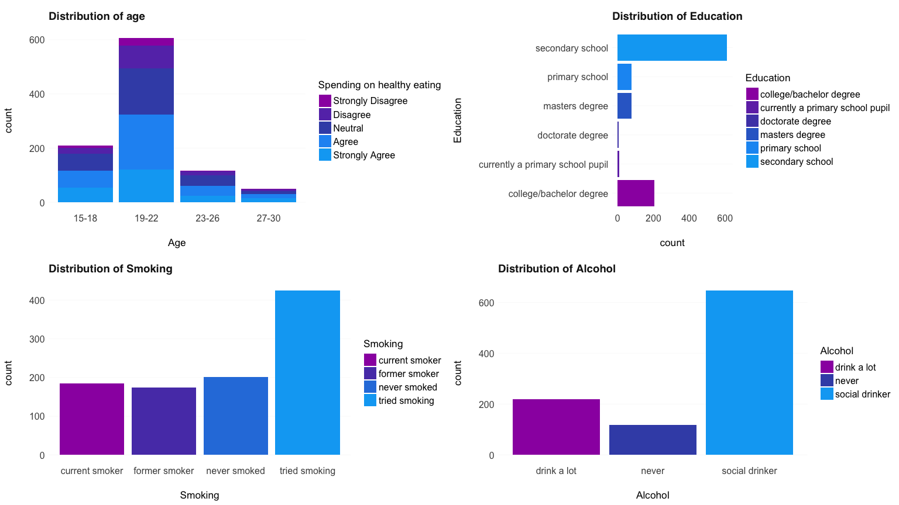
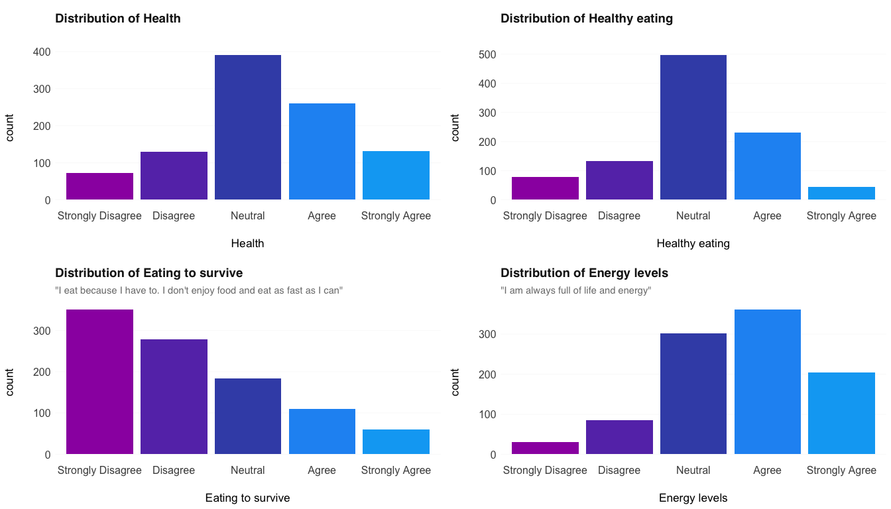
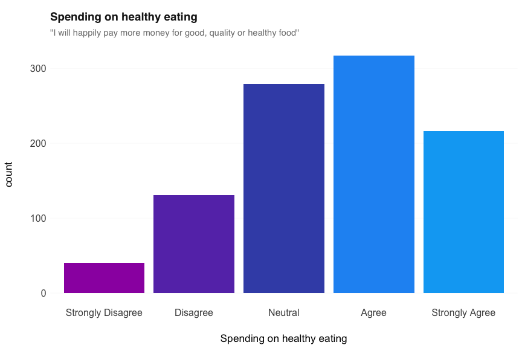
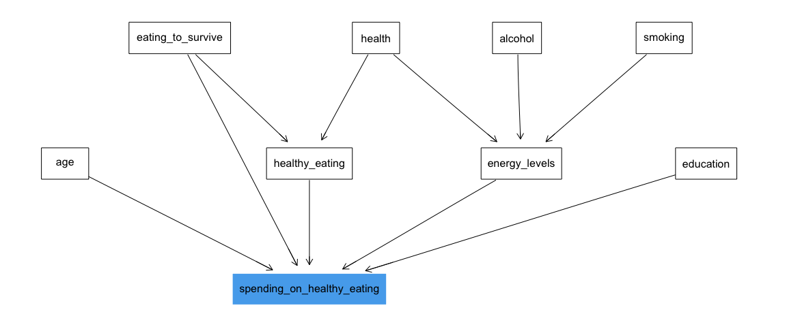

# **searching for the target group** 🎯

The goal of small research is to analyze the survey among young people and produce recommendations for a Slovak start-up company on two main points: 

> *how to frame the ad campaign?*    
> *who to target with the products?*   

The company offers a wide range of products, however, here the focus is on the new **superfood delivery**. 


# **data**


### preparation

Before examining the data and building a Bayesian network, a nice idea is to search for the existing research and see what factors may be possibly connected to the positive attitude towards the superfood. Again, I formulated several Google searches to answer the following:

> *what is exactly superfood??*    
> *is there any existing research on the superfood?*    
> *who buys superfood?*  

#### > what is superfood 

According to the [Harvard Health Blog](https://www.health.harvard.edu/blog/10-superfoods-to-boost-a-healthy-diet-2018082914463), superfood is:  

- berries  
- fish (salmon may be the healthiest)   
- leafy greens (e.g. spinach, swiss chard)  
- nuts  
- olive oil  
- whole grains (e.g. oatmeal)  
- yogurt (better without flavors!)  
- cruciferous vegetables (e.g. broccoli, cabbage)  
- legumes (e.g. kidney, black/red/garbanzo beans; add to salads!)  
- tomatoes  
- avocados are cool as well; and i guess hipster enough. [[🥑]](https://www.health.harvard.edu/heart-health/sizing-up-superfoods-for-heart-health).   

[Uber Eats](https://www.ubereats.com/en-LK/colombo/food-delivery/superfood/efsy0cEwR8KzRO-tM3Yp0A/) also has such "superfood delivery" feature! Smoked salmon open topped sandwich... yum. As the website states, the superfoods they provide are: 

- Healthy  
- Vegan Friendly  
- Vegetarian Friendly  
- Allergy Friendly


Summing up, seems like an ideal **potential customer** may be someone who follows a healthy lifestyle, loves fruits & vegetables (more specific food preferences and requests), likely follows the trends (maybe even in tech, you know: grabbing a smoothie after a long practice and closing activity rings on Apple Watch..). And, perhaps, a female. But targeting by gender is rather criticized lately, so it's better not to do that, at least with the superfood delivery [[4]](https://www.wsj.com/articles/facebook-axes-age-gender-and-other-targeting-for-some-sensitive-ads-11553018450). Actually, sounds like Gen Z or millennials.  


#### > who buys 🤔

Based on [Australian](http://www.roymorgan.com/findings/7602-food-delivery-services-march-2018-201805240625) publication, 22.5% of metrotechs use food delivery services, and this is the highest percentage among other categories identified [here](http://www.roymorgan.com/products/helix-personas).

> *Metrotechs:* "Socially aware, successful, career focussed and culturally diverse, are trend and tech focused. They are committed experience seekers, willing to spend big on the best of city life and thrive on being out and about in the world."

Well, this is quite consistent with the suggestions from the previous sub-section and my general knowledge. Nice!


### choosing the features & outcome

The dataset contains 150 variables that may be split into the following groups:

1) Music preferences (19 items)  
2) Movie preferences (12 items)  
3) Hobbies & interests (32 items)  
4) Phobias (10 items)  
5) Health habits (3 items)  
6) Personality traits, views on life, & opinions (57 items)  
7) Spending habits (7 items)  
8) Demographics (10 items)  

As the aim of this research is to find a target group for the new superfood delivery, music & movie preferences & phobias are less likely to influence the adoption of such product and, at least on this stage, can be dropped. As for other categories, I've selected questions related to healthy lifestyle, attitude to animals and spendings on healthy food. The latter is selected as an "outcome" variable because it directly relates to whether a person is willing to spend money on good & healthy food, i.e. superfood 🍏. Also meaning that it would best predict the adoption of the superfood delivery app as it implies delivering the high quality & healthy products. 


```r
yps_r = read_csv("young-people-survey/columns.csv")
yps_c = read_csv("young-people-survey/responses.csv")
```


> "I will happily pay more money for good, quality or healthy food" - the selected **outcome variable** among those available in the survey, which would best predict the adoption of the superfood delivery. 

In the next section, I present the hypotheses and, based on them, create a Bayesian network.


<table class="table table-striped table-hover table-condensed table-responsive" style="margin-left: auto; margin-right: auto;">
 <thead>
  <tr>
   <th style="text-align:left;"> group </th>
   <th style="text-align:left;"> question </th>
   <th style="text-align:left;"> scale </th>
  </tr>
 </thead>
<tbody>
  <tr>
   <td style="text-align:left;"> <span style="     color: #ea4c89 !important;">health habits</span> </td>
   <td style="text-align:left;"> Smoking habits </td>
   <td style="text-align:left;"> Never smoked - Tried smoking - Former smoker - Current smoker </td>
  </tr>
  <tr>
   <td style="text-align:left;"> <span style="     color: #ea4c89 !important;">health habits</span> </td>
   <td style="text-align:left;"> Drinking </td>
   <td style="text-align:left;"> Never - Social drinker - Drink a lot </td>
  </tr>
  <tr>
   <td style="text-align:left;"> <span style="     color: #ea4c89 !important;">health habits</span> </td>
   <td style="text-align:left;"> I live a very healthy lifestyle </td>
   <td style="text-align:left;"> Strongly disagree 1-2-3-4-5 Strongly agree </td>
  </tr>
  <tr>
   <td style="text-align:left;"> <span style="     color: #0077B5 !important;">traits, views on life &amp; opinions</span> </td>
   <td style="text-align:left;"> I eat because I have to. I don't enjoy food and eat as fast as I can </td>
   <td style="text-align:left;"> Strongly disagree 1-2-3-4-5 Strongly agree </td>
  </tr>
  <tr>
   <td style="text-align:left;"> <span style="     color: #0077B5 !important;">traits, views on life &amp; opinions</span> </td>
   <td style="text-align:left;"> I worry about my health </td>
   <td style="text-align:left;"> Strongly disagree 1-2-3-4-5 Strongly agree </td>
  </tr>
  <tr>
   <td style="text-align:left;"> <span style="     color: #0077B5 !important;">traits, views on life &amp; opinions</span> </td>
   <td style="text-align:left;"> I am always full of life and energy </td>
   <td style="text-align:left;"> Strongly disagree 1-2-3-4-5 Strongly agree </td>
  </tr>
  <tr>
   <td style="text-align:left;"> <span style="     color: #ff6600 !important;">outcome, spending habits</span> </td>
   <td style="text-align:left;"> I will happily pay more money for good, quality or healthy food </td>
   <td style="text-align:left;"> Strongly disagree 1-2-3-4-5 Strongly agree </td>
  </tr>
  <tr>
   <td style="text-align:left;"> <span style="     color: #410093 !important;">demographics</span> </td>
   <td style="text-align:left;"> Age </td>
   <td style="text-align:left;"> int. </td>
  </tr>
  <tr>
   <td style="text-align:left;"> <span style="     color: #410093 !important;">demographics</span> </td>
   <td style="text-align:left;"> Gender </td>
   <td style="text-align:left;"> Female-Male </td>
  </tr>
  <tr>
   <td style="text-align:left;"> <span style="     color: #410093 !important;">demographics</span> </td>
   <td style="text-align:left;"> Highest education achieved </td>
   <td style="text-align:left;"> Currently a Primary school pupil - Primary school - Secondary school - College/Bachelor degree </td>
  </tr>
</tbody>
</table>


# **bayesian network**

### data preparation

The first step before proceeding to the creation of the Bayesian network is variables selection. In total, I ended up with the 9 variables related to demographic information, bad habits, healthy eating and spendings on such eating. Further I removed rows with NAs, the final dataset resulting into 983 observations & 9 columns. 

```r
bn_yps = yps_c %>% dplyr::select("Age", "Education","Smoking", "Alcohol", "Health", "Healthy eating", "Eating to survive", "Energy levels",  "Spending on healthy eating") %>% na.omit()
kableExtra::kable(head(bn_yps), format = "markdown")
```


| Age|Education               |Smoking       |Alcohol        | Health| Healthy eating| Eating to survive| Energy levels| Spending on healthy eating|
|---:|:-----------------------|:-------------|:--------------|------:|--------------:|-----------------:|-------------:|--------------------------:|
|  20|college/bachelor degree |never smoked  |drink a lot    |      1|              4|                 1|             5|                          3|
|  19|college/bachelor degree |never smoked  |drink a lot    |      4|              3|                 1|             3|                          2|
|  20|secondary school        |tried smoking |drink a lot    |      2|              3|                 5|             4|                          2|
|  22|college/bachelor degree |former smoker |drink a lot    |      1|              3|                 1|             2|                          1|
|  20|secondary school        |tried smoking |social drinker |      3|              4|                 1|             5|                          4|
|  20|secondary school        |never smoked  |never          |      3|              2|                 2|             4|                          4|


Transforming to factors and mapping the levels:  

- all but `age` - in accordance with the original specification    
- `age` - tried to split into more/less explainable intervals, 4 yrs each:   
  - 15 - 18 (~ ending school)    
  - 19 - 22 (~ university)   
  - 23 - 26 (~ uni/job)   
  - 27 - 30 - (~ job/starting family)    
 

```r
summary(bn_yps$Age)
```

```
##    Min. 1st Qu.  Median    Mean 3rd Qu.    Max. 
##   15.00   19.00   20.00   20.44   22.00   30.00
```


Next, the basic statistics of the data, showing the number of (1) factor levels, (2) number of observations in each. 


```
## The data contains 983 observations of the following variables:
##   - Age: 4 levels: 15-18 (n = 210); 19-22 (n = 605); 23-26 (n = 118) and 27-30 (n = 50)
##   - Education: 6 levels: college/bachelor degree (n = 204); currently a primary school pupil (n = 9); doctorate degree (n = 5); masters degree (n = 77); primary school (n = 77) and secondary school (n = 611)
##   - Smoking: 4 levels: current smoker (n = 184); former smoker (n = 174); never smoked (n = 201) and tried smoking (n = 424)
##   - Alcohol: 3 levels: drink a lot (n = 219); never (n = 118) and social drinker (n = 646)
##   - Health: 5 levels: Strongly Disagree (n = 72); Disagree (n = 129); Neutral (n = 390); Agree (n = 261) and Strongly Agree (n = 131)
##   - Healthy eating: 5 levels: Strongly Disagree (n = 79); Disagree (n = 132); Neutral (n = 496); Agree (n = 231) and Strongly Agree (n = 45)
##   - Eating to survive: 5 levels: Strongly Disagree (n = 350); Disagree (n = 279); Neutral (n = 184); Agree (n = 110) and Strongly Agree (n = 60)
##   - Energy levels: 5 levels: Strongly Disagree (n = 31); Disagree (n = 85); Neutral (n = 302); Agree (n = 361) and Strongly Agree (n = 204)
##   - Spending on healthy eating: 5 levels: Strongly Disagree (n = 40); Disagree (n = 131); Neutral (n = 279); Agree (n = 317) and Strongly Agree (n = 216)
```


What are the main parts here?  

- most of the responses for the selected variables were received from 19-22 y.o., next largest age group - 15-18  
- the 611 studied in secondary school, 204 - college/bachelor degree. A few with doctorate degree are presented here as well   
- most of the respondents have tried smoking (n=424), while 184 are currently doing that, 174 stopped and 201 never tried  
- what is interesting - 66% consider themselves as social drinkers (is this college life).  


<!-- -->


Mostly, young people do not eat just to survive. However, 170 agreed (& strongly) with this statement, and probably represent the audience that we do not want to target as they don't like food that much. Half (496) of the respondents neutrally estimated the "I live a very healthy lifestyle", i.e. neither agreed not disagreed. Though, 231 and 45 agreed and strongly agreed. And these are the ones that better be targeted, I guess!  Healthy lifestylers need heathy food. Good finding: students mostly do feel energetic.  


<!-- -->


As for the **outcome**, the **majority agreed** that they would happily pay more money for good, quality or healthy food, nice!


<!-- -->


### construction

The hypotheses behind that are as following:

1. `Age`: as stated in the previous sections, younger people faster adapt to various services that emerge, and for them it's easier to get into something new. So, delivering superfood may sound super attractive for them, especially if having a healthy lifestyle is a trend. 
2. `Education`: people with higher levels of educations likely know more about various vitamins and benefits of healty lifestyle  
3. `Smoking`: smoking is definitely not a part of a healty lifestyle, so, perhaps, current smokers are not the best audience for targeting    
4. `Alcohol`: same applies to drinking - very bad for health   
5. `Health`: being concerned about the health means that a person cares about his/her health, which is good    
6. `Healthy eating`: one of the most important variables that should be taken into the account is it. If a person prefers eating healthy foods & in addition finds it difficult to get wanted product, he/she may be willing to pay for delivery; directly influences the outcome as if a person strognly agrees on eating health, then he/she probobly is ready to pay more; also influenced by `eating to survive` and `health`: just surviving - not healthy eating. Cares about health - eats healthy.      
7. `Eating to survive`: if a person does not like food, it's better not to target them & not make feel even worse while reminding them something that they don't like; 
8. `Energy levels` - sometimes being energetic means being open for new suggestions - superfood delivry; especially if you have a healthy lifestyle! this also has ties to Health, Alcohol and Smoking as bad habits may badly influence the organism & energy          
9. `Spending on healthy eating` - shows whether and how much a person would spend on such food?    


<!-- -->

For simplicity, split variables into `"rather_yes"` (agrees) and `"rather no"` (neutral or disagrees)


### fitting & examining


```r
net_yps = bn.fit(bn, data = data.frame(bn_yps))
```

The probability of subscription based on our small dataset is 0.49%. 
```
## [1] 0.4916
```


Let's look at several combinations. Some of them present ones that are suitable for targeting, while some - bad ones that should be avoided.

1. High scores for questions related to health, no bad habits, 19-22: such person has a probability of 0.57 to subscribe, nice!  


```
## [1] 0.5714286
```

2. Similar situation: caring about healthy lifestyle, aged 19-22, but is a social drinker:   
  - the probability decreases to 0.5, meaning that social drinkers have lower probability of subscription to the service. Logical as alcohol is super bad for health  


```
## [1] 0.5
```

3. Does not care about health, has bad habits, (still does not eat for survival): the probability lowers to 0.44! 
  
  
```
## [1] 0.4444444
```

In sum this means that the more caring a person is about health and the less bad habits - the better he/she fits for targeting. 

#### a bit more

How does the education relate to the outcome?  

- the highest P for those with college/bachelor degree and primary school  
- however, if a person has not yet finished a primary school, the probability is lower (0.48 compared to 0.58)  
- for most, the prob. is around 0.53  

Overall, there might be some relationship between the education level and spendings on healthy food.


```
##                                   spending_on_healthy_eating
## education                          rather_no rather_yes
##   college/bachelor degree          0.4614959  0.5385041
##   currently a primary school pupil 0.5203279  0.4796721
##   doctorate degree                 0.4743548  0.5256452
##   masters degree                   0.4753624  0.5246376
##   primary school                   0.4235053  0.5764947
##   secondary school                 0.4658607  0.5341393
```

Bad habits. Firstly, let's look at smoking. Seems like it does not influence the outcome that much! Perhaps, because it does not require drinking or eating something unhealthy.


```
##                 spending_on_healthy_eating
## smoking          rather_no rather_yes
##   current smoker 0.4625700  0.5374300
##   former smoker  0.4627665  0.5372335
##   never smoked   0.4633831  0.5366169
##   tried smoking  0.4629230  0.5370770
```

So does the alcohol! Thi turned out to be quite surprising: not much difference here as well. This leads to the conclusion that bad habits do not relate to spendings on health that much.


```
##                 spending_on_healthy_eating
## alcohol          rather_no rather_yes
##   drink a lot    0.4629967  0.5370033
##   never          0.4632088  0.5367912
##   social drinker 0.4628463  0.5371537
```

Eating healthy? Then the probability increases from 0.48 to 0.69! People who follow healthy diets are willing to pay more for good & healthy food.  


```
##               spending_on_healthy_eating
## healthy_eating rather_no rather_yes
##     rather_no  0.5212930  0.4787070
##     rather_yes 0.3130869  0.6869131
```

Those who eat for survival also do have lower probability of the service adoption. If he/she rather does consume food in that way, the probability is 0.457, while if not - 0.57.

```
##                  spending_on_healthy_eating
## eating_to_survive rather_no rather_yes
##        rather_no  0.4439951  0.5560049
##        rather_yes 0.5534447  0.4465553
```

What about age? Well, not much difference here too. However, it's better to focus on people from, 15 to 26. 

```
##        spending_on_healthy_eating
## age     rather_no rather_yes
##   15-18 0.4424410  0.5575590
##   19-22 0.4629685  0.5370315
##   23-26 0.4659383  0.5340617
##   27-30 0.5412861  0.4587139
```


# **conclusion**

This work examined the factors that may lead to the adoption of the superfood delivery service. Overall, the company should target clients aged 15-26 who follow a healthy lifestyle, are energetic ,and pursue education. This also may be done regardless of whether a person has bad habits as according to the conditional probability tables, drinking or smoking does not influnce the willingness to spend money on healthy food.


# **references**

[[1] 10 superfoods to boost a healthy diet - Harvard Health Blog](https://www.health.harvard.edu/blog/10-superfoods-to-boost-a-healthy-diet-2018082914463)  
[[2] Sizing up 'superfoods' for heart health - Harvard Health](https://www.health.harvard.edu/heart-health/sizing-up-superfoods-for-heart-health)  
[[3] Superfood Delivery | Uber Eats](https://www.ubereats.com/en-LK/colombo/food-delivery/superfood/efsy0cEwR8KzRO-tM3Yp0A/)   
[[4] Facebook Axes Age, Gender and Other Targeting for Some Sensitive Ads - WSJ](https://www.wsj.com/articles/facebook-axes-age-gender-and-other-targeting-for-some-sensitive-ads-11553018450)   
[[5] Metrotechs and Millennials have taken to Uber Eats, Menulog, Deliveroo, Foodora and more](http://www.roymorgan.com/findings/7602-food-delivery-services-march-2018-201805240625)   
[[6] Helix Personas - Roy Morgan Research](http://www.roymorgan.com/products/helix-personas)   

***

guess now i'm closer to being a healthy analyst.


 
