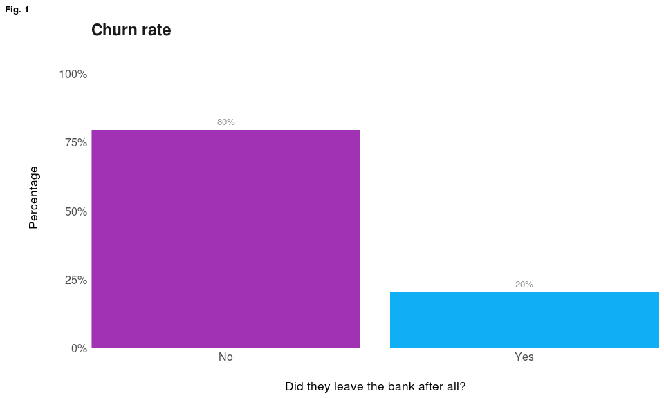
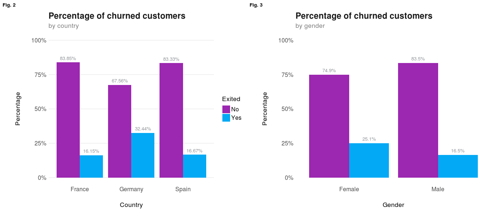
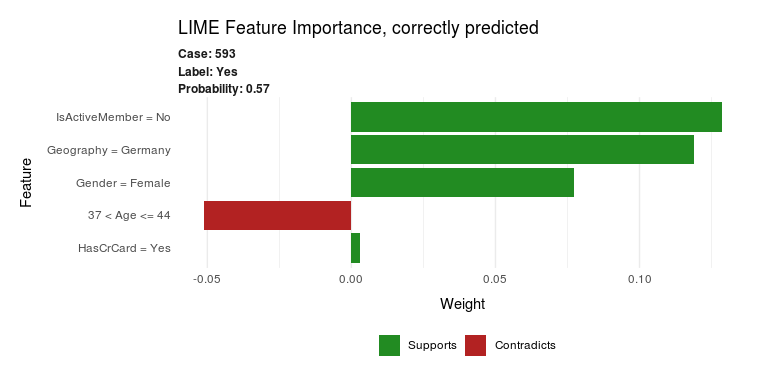
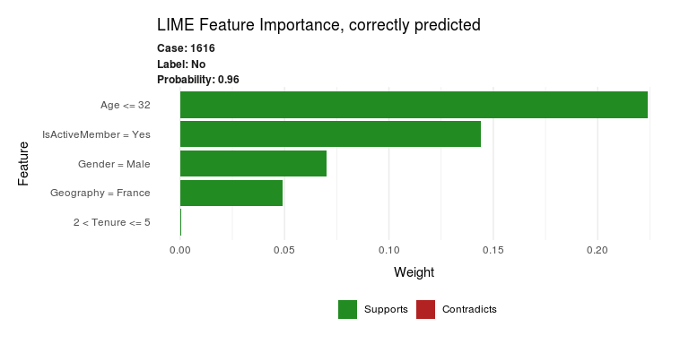
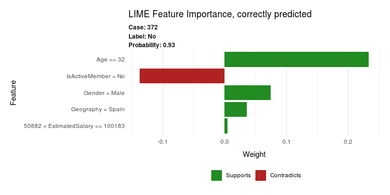
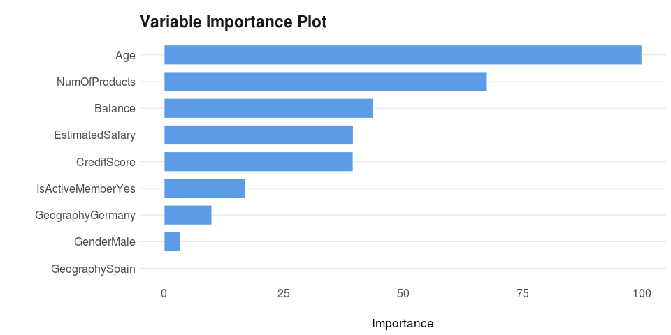
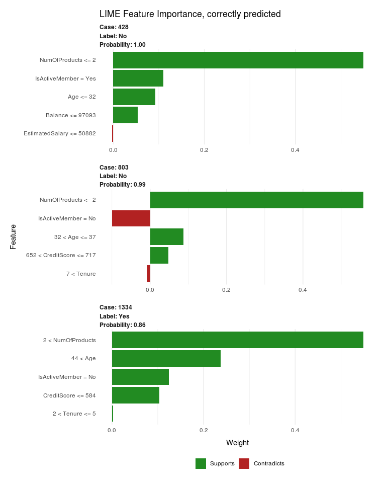
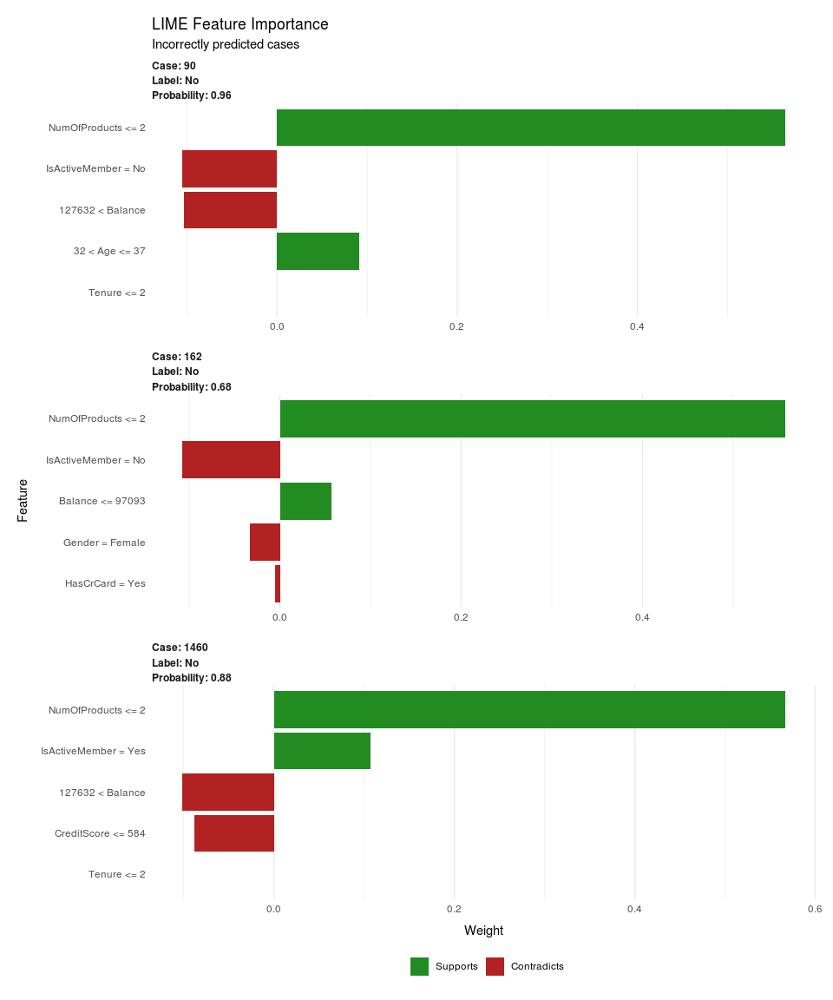
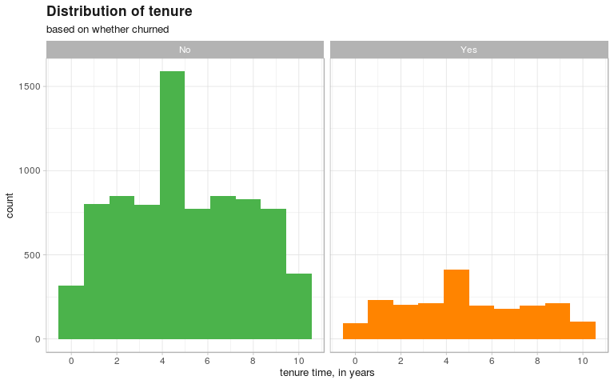

# Bank Customer Churn Modeling 
*author: Ekaterina Skriptsova*  
*date: 2019-10-31*  

The purpose of this analysis is to examine the data on bank customers from the Halloween BI, Ltd. 🎃 and find out: 

> What are the most important factors for predicting customer churn in this bank? 
> How much time does the bank have on average before a customer churns?

To do so, I firstly completed an exploratory data analysis in order to get familiar with the data and identify possible predictors for customers leaving the bank. Then, predicted churn with a logistic regression model, decision tree and random forest, comparing their performance and assessing quality. For the first and the latter, randomly selected cases were analyzed in order to understand when model makes a correct prediction and when it completes a mistake. In the last part, time to churn was predicted.

## Preparation


As a first step, let's take a look at the dataset. The first column `RowNumber` was excluded as it is simply a row number, which is equivalent to the already existing indexes.  

```
## 
## -----------------------------------------------------------------------------------------------------------------------------------------------------------
##  CustomerId   Surname    CreditScore   Geography   Gender   Age   Tenure   Balance   NumOfProducts   HasCrCard   IsActiveMember   EstimatedSalary   Exited 
## ------------ ---------- ------------- ----------- -------- ----- -------- --------- --------------- ----------- ---------------- ----------------- --------
##   15634602    Hargrave       619        France     Female   42      2         0            1             1             1              101349          1    
## 
##   15647311      Hill         608         Spain     Female   41      1       83808          1             0             1              112543          0    
## 
##   15619304      Onio         502        France     Female   42      8      159661          3             1             0              113932          1    
## 
##   15701354      Boni         699        France     Female   39      1         0            2             0             0               93827          0    
## 
##   15737888    Mitchell       850         Spain     Female   43      2      125511          1             1             1               79084          0    
## 
##   15574012      Chu          645         Spain      Male    44      8      113756          2             1             0              149757          1    
## -----------------------------------------------------------------------------------------------------------------------------------------------------------
```


Several variables have only two different values (0 & 1), and represent categorical features but are treated as integers. Thus, I converted `HasCrCard`, `IsActiveMember` and `Exited` to factor. This way R models will treat them correctly. By mapping the resulting values to "No" and "Yes" interpretation and visualization become slightly easier as well. 

```
## 'data.frame':	10000 obs. of  13 variables:
##  $ CustomerId     : int  15634602 15647311 15619304 15701354 15737888 15574012 15592531 15656148 15792365 15592389 ...
##  $ Surname        : Factor w/ 2932 levels "Abazu","Abbie",..: 1116 1178 2039 290 1823 538 178 1989 1147 1082 ...
##  $ CreditScore    : int  619 608 502 699 850 645 822 376 501 684 ...
##  $ Geography      : Factor w/ 3 levels "France","Germany",..: 1 3 1 1 3 3 1 2 1 1 ...
##  $ Gender         : Factor w/ 2 levels "Female","Male": 1 1 1 1 1 2 2 1 2 2 ...
##  $ Age            : int  42 41 42 39 43 44 50 29 44 27 ...
##  $ Tenure         : int  2 1 8 1 2 8 7 4 4 2 ...
##  $ Balance        : num  0 83808 159661 0 125511 ...
##  $ NumOfProducts  : int  1 1 3 2 1 2 2 4 2 1 ...
##  $ HasCrCard      : int  1 0 1 0 1 1 1 1 0 1 ...
##  $ IsActiveMember : int  1 1 0 0 1 0 1 0 1 1 ...
##  $ EstimatedSalary: num  101349 112543 113932 93827 79084 ...
##  $ Exited         : int  1 0 1 0 0 1 0 1 0 0 ...
```


The following output summarizes the information about the available features:  

- No missing data  
- Customers come from three countries, and majority is from France  
- Age of the clients ranges from 18 to 92  
- Some of them stayed with the bank for 10 years, on average - ~5  
- Most of the customers have a credit card  
- Estimated salary range is quite high  
 

```
## The data contains 10000 observations of the following variables:
##   - CreditScore: Mean = 650.53, SD = 96.65, range = [350, 850], 0 missing
##   - Geography: 3 levels: France (n = 5014); Germany (n = 2509) and Spain (n = 2477)
##   - Gender: 2 levels: Female (n = 4543) and Male (n = 5457)
##   - Age: Mean = 38.92, SD = 10.49, range = [18, 92], 0 missing
##   - Tenure: Mean = 5.01, SD = 2.89, range = [0, 10], 0 missing
##   - Balance: Mean = 76485.89, SD = 62397.41, range = [0, 250898.09], 0 missing
##   - NumOfProducts: Mean = 1.53, SD = 0.58, range = [1, 4], 0 missing
##   - HasCrCard: 2 levels: No (n = 2945) and Yes (n = 7055)
##   - IsActiveMember: 2 levels: No (n = 4849) and Yes (n = 5151)
##   - EstimatedSalary: Mean = 100090.24, SD = 57510.49, range = [11.58, 199992.48], 0 missing
##   - Exited: 2 levels: No (n = 7963) and Yes (n = 2037)
```


## Exploratory Data Analysis 🚀

### churn


The exploration starts by looking at how many customers churn at all.  
The **churn rate** is **20.4%**, meaning that approximately $20.4\%$ of the customers decided to leave the bank, and $79.6\%$ have stayed.


<!-- -->


Apart from the main target variable, there are 12 features. The first two relate to customers’ personal information, their id - `CustomerId` and `Surname`, and cannot be used in the predictive models. 

So, let's examine other features and check whether churners have some common characteristics by looking how churn rate differs depending on `Gender` and `Geography` (country). 

- Churn rate is $20.4\%$, however, it is higher for customers in Germany: $32.4\%$ of them have churned, comparing to $16.2\%$ and $16.7\%$ in France and Spain respectively (Fig.2)  
- Among females, the percentage of those who left the bank was by $8.6\%$ higher than for males: $25.1\%$ compared to $16.5\%$ (Fig.3)

<!-- -->


The `Age` density for those who stayed and churned is different: according to the Fig.4, median age of churned customers is higher, and more younger clients are present in group of retained. Consequently, `Age` may act as a predictor of exiting. Three vertical lines represent the median age: black - of all customers, orange - of exited clients, green - of stayed. 


```
## [1] "Median age of stayed customers: 36"
```

```
## [1] "Median age of exited customers: 45"
```


- The `Balance` and `CreditScore` of customers seem to have no or little visible relationship with `Age`
- Observations with the lowest credit score (< 400) are those who exited (Fig. 7)


<!-- -->


Let's look at the `Balance` (Fig. 8a & 8b). Both clients with low and high balance ($39\%$ of have $\$0$) are present among the stayed customers. Churned ones also do have some money on their closed bank accounts, while $24.5\%$ of them had zero. #StrangerThings.  
I guess more information should have been added on what exactly does this variable mean and whether the data was obtained at the same time as other labels. Perhaps, there are other causes of accounts' cancellation? Or the `Balance` variable was not updated after the customer left? *(took money -> cancelled -> 0)*  


```
## [1] "Percentage of retained clients with 0 balance: 39.143539"
```

```
## [1] "Percentage of churned clients with 0 balance: 24.545901"
```

The median balance of churned customers was higher compared to the stayed ones. The company should check, for instance, whether current offers/plans suit such customers, and if not, introduce new ones, as exits of clients with high balance may negatively affect the bank. 
*(can't say more as sadly nothing is stated about the available plans)*

<!-- -->

Meanwhile, density of `CreditScore` distribution is more or less the same for both exited and stayed. 
<!-- -->


Moving to other attributes about customer’s account: `HasCrCard`, `NumOfProducts` and `IsActiveMember`.  
The first one seems to be less useful as churn rate does not differ depending on whether the customer holds a credit card with the bank or not (Fig. 10).  

Let’s see how the churn rate changes as the number of bank products the customer is subscribed to *(or uses)* increases. This is a super interesting attribute as clients with 3 or 4 products have higher churn rate compared to the ones with 1-2: $100\%$ of customers with 4 products have churned!  
Unfortunately, it is unknown which products the clients were using, and which ones may cause an increase of churn rate. The bank should carefully review which services have such a high rate and consider introduction of changes. 

According to another plot below (Fig. 12), among active members churn rate is lower. As stated in the data description, the variable `IsActiveMember` of the bank is subjective *"(Subjective, but for the concept)"*, so it is unclear how it was constructed. It would be interesting to see how exactly this feature was obtained and to which extent its definition differs from `Exited`.

<!-- -->

Based on the output below, there were 326 (~3%) customers with 3 and more products (only 60 of them had 4).  
By comparing it to the description of entire dataset:  

- the mean age of these clients is higher
- now there are slighly more females than males: $57\%$ in subset compared to $45\%$ in full dataset  
- $85\%$ of these clients churned!

Unfortunately, it is impossible to see whether all of them were subscribed to/used the same product, but it may be so. 

```
## [1] "------------ Description of full dataset -----------"
```

```
## The data contains 10000 observations of the following variables:
##   - CreditScore: Mean = 650.53, SD = 96.65, range = [350, 850], 0 missing
##   - Geography: 3 levels: France (n = 5014); Germany (n = 2509) and Spain (n = 2477)
##   - Gender: 2 levels: Female (n = 4543) and Male (n = 5457)
##   - Age: Mean = 38.92, SD = 10.49, range = [18, 92], 0 missing
##   - Tenure: Mean = 5.01, SD = 2.89, range = [0, 10], 0 missing
##   - Balance: Mean = 76485.89, SD = 62397.41, range = [0, 250898.09], 0 missing
##   - NumOfProducts: Mean = 1.53, SD = 0.58, range = [1, 4], 0 missing
##   - HasCrCard: 2 levels: No (n = 2945) and Yes (n = 7055)
##   - IsActiveMember: 2 levels: No (n = 4849) and Yes (n = 5151)
##   - EstimatedSalary: Mean = 100090.24, SD = 57510.49, range = [11.58, 199992.48], 0 missing
##   - Exited: 2 levels: No (n = 7963) and Yes (n = 2037)
```

```
## [1] "------ Description of the subset of customers with 3-4 products ------"
```

```
## The data contains 326 observations of the following variables:
##   - CreditScore: Mean = 649.11, SD = 96.20, range = [358, 850], 0 missing
##   - Geography: 3 levels: France (n = 133); Germany (n = 120) and Spain (n = 73)
##   - Gender: 2 levels: Female (n = 187) and Male (n = 139)
##   - Age: Mean = 43.65, SD = 10.15, range = [21, 77], 0 missing
##   - Tenure: Mean = 5.06, SD = 2.89, range = [0, 10], 0 missing
##   - Balance: Mean = 78821.79, SD = 62283.19, range = [0, 250898.09], 0 missing
##   - NumOfProducts: Mean = 3.18, SD = 0.39, range = [3, 4], 0 missing
##   - HasCrCard: 2 levels: No (n = 95) and Yes (n = 231)
##   - IsActiveMember: 2 levels: No (n = 184) and Yes (n = 142)
##   - EstimatedSalary: Mean = 104400.14, SD = 55759.76, range = [3440.47, 199357.24], 0 missing
##   - Exited: 2 levels: No (n = 46) and Yes (n = 280)
```

The next plot shows the associations between continuous data attributes. Almost all variables are not correlated with each other, apart from several combinations that were previously identified as those that may be important for further predictive models: (1) `Balance` and `NumOfProducts`, (2) `Exited` and `Age`, (3) `Exited` and `Balance`. The correlation coefficients between $0.1$ and $0.3$ indicate that there may be small association between these variables.

<!-- -->


### tenure

`Tenure` is the second variable of interest in the to-do list. Let's see how it is related to the other ones. Overall, the mean tenure time in the dataset equals 5, meaning that a lot of customers have been with the bank for around 5 years.  

<!-- -->


As shown in the plots below, the distribution of `Tenure` does not differ with `HasCrCard`, `Geography`, `Gender` and `IsActiveMember` (boxplots everywhere...).
<!-- -->

The scatter plots present the relationship between tenure time and continuous attributes. Again, as it was previously shown on the correlation plot, there is little or no relationship between the variables.
<!-- -->

 


***


# Churn Prediction


## Logistic Regression

For the first model, I employed a logistic regression with 5-fold cross-validation as train control. The preparation steps included removal of `CustomerId` and `Surname` variables and split of the data into two parts: the first one to be used for training and cross-validation, while the second one - as a validation part.   

Features were selected using `stepAIC` function which allows comparing several models such that variables are dropped and added based on their significance, and this process stops when a minimum AIC is reached. Based on the results, the function dropped two features, `HasCrCard` and `EstimatedSalary`, that were marked as possibly not important on EDA stage.


The resulting output shows variables `Geography` (Germany), `Gender` (Male), `Age`, `Balance`, `NumOfProducts`, `CreditScore`, `IsActiveMember` (Yes) have a significant effect on customer staying or exiting, as p-values for these features are $<.005$, meaning that the probability of finding results like this or more extreme, assuming `{variable}` has no effect, is $5\%$. 


<table style="border-collapse:collapse; border:none;">
<tr>
<th style="border-top: double; text-align:center; font-style:normal; font-weight:bold; padding:0.2cm;  text-align:left; ">&nbsp;</th>
<th colspan="3" style="border-top: double; text-align:center; font-style:normal; font-weight:bold; padding:0.2cm; ">outcome</th>
</tr>
<tr>
<td style=" text-align:center; border-bottom:1px solid; font-style:italic; font-weight:normal;  text-align:left; ">Predictors</td>
<td style=" text-align:center; border-bottom:1px solid; font-style:italic; font-weight:normal;  ">Odds Ratios</td>
<td style=" text-align:center; border-bottom:1px solid; font-style:italic; font-weight:normal;  ">CI</td>
<td style=" text-align:center; border-bottom:1px solid; font-style:italic; font-weight:normal;  ">p</td>
</tr>
<tr>
<td style=" padding:0.2cm; text-align:left; vertical-align:top; text-align:left; ">(Intercept)</td>
<td style=" padding:0.2cm; text-align:left; vertical-align:top; text-align:center;  ">0.04</td>
<td style=" padding:0.2cm; text-align:left; vertical-align:top; text-align:center;  ">0.03&nbsp;&ndash;&nbsp;0.07</td>
<td style=" padding:0.2cm; text-align:left; vertical-align:top; text-align:center;  "><strong>&lt;0.001</td>
</tr>
<tr>
<td style=" padding:0.2cm; text-align:left; vertical-align:top; text-align:left; ">Credit Score</td>
<td style=" padding:0.2cm; text-align:left; vertical-align:top; text-align:center;  ">1.00</td>
<td style=" padding:0.2cm; text-align:left; vertical-align:top; text-align:center;  ">1.00&nbsp;&ndash;&nbsp;1.00</td>
<td style=" padding:0.2cm; text-align:left; vertical-align:top; text-align:center;  "><strong>0.002</strong></td>
</tr>
<tr>
<td style=" padding:0.2cm; text-align:left; vertical-align:top; text-align:left; ">Geography Germany</td>
<td style=" padding:0.2cm; text-align:left; vertical-align:top; text-align:center;  ">2.08</td>
<td style=" padding:0.2cm; text-align:left; vertical-align:top; text-align:center;  ">1.79&nbsp;&ndash;&nbsp;2.41</td>
<td style=" padding:0.2cm; text-align:left; vertical-align:top; text-align:center;  "><strong>&lt;0.001</td>
</tr>
<tr>
<td style=" padding:0.2cm; text-align:left; vertical-align:top; text-align:left; ">Geography Spain</td>
<td style=" padding:0.2cm; text-align:left; vertical-align:top; text-align:center;  ">0.99</td>
<td style=" padding:0.2cm; text-align:left; vertical-align:top; text-align:center;  ">0.85&nbsp;&ndash;&nbsp;1.16</td>
<td style=" padding:0.2cm; text-align:left; vertical-align:top; text-align:center;  ">0.947</td>
</tr>
<tr>
<td style=" padding:0.2cm; text-align:left; vertical-align:top; text-align:left; ">Gender Male</td>
<td style=" padding:0.2cm; text-align:left; vertical-align:top; text-align:center;  ">0.59</td>
<td style=" padding:0.2cm; text-align:left; vertical-align:top; text-align:center;  ">0.52&nbsp;&ndash;&nbsp;0.66</td>
<td style=" padding:0.2cm; text-align:left; vertical-align:top; text-align:center;  "><strong>&lt;0.001</td>
</tr>
<tr>
<td style=" padding:0.2cm; text-align:left; vertical-align:top; text-align:left; ">Age</td>
<td style=" padding:0.2cm; text-align:left; vertical-align:top; text-align:center;  ">1.07</td>
<td style=" padding:0.2cm; text-align:left; vertical-align:top; text-align:center;  ">1.07&nbsp;&ndash;&nbsp;1.08</td>
<td style=" padding:0.2cm; text-align:left; vertical-align:top; text-align:center;  "><strong>&lt;0.001</td>
</tr>
<tr>
<td style=" padding:0.2cm; text-align:left; vertical-align:top; text-align:left; ">Tenure</td>
<td style=" padding:0.2cm; text-align:left; vertical-align:top; text-align:center;  ">0.99</td>
<td style=" padding:0.2cm; text-align:left; vertical-align:top; text-align:center;  ">0.97&nbsp;&ndash;&nbsp;1.01</td>
<td style=" padding:0.2cm; text-align:left; vertical-align:top; text-align:center;  ">0.180</td>
</tr>
<tr>
<td style=" padding:0.2cm; text-align:left; vertical-align:top; text-align:left; ">Balance</td>
<td style=" padding:0.2cm; text-align:left; vertical-align:top; text-align:center;  ">1.00</td>
<td style=" padding:0.2cm; text-align:left; vertical-align:top; text-align:center;  ">1.00&nbsp;&ndash;&nbsp;1.00</td>
<td style=" padding:0.2cm; text-align:left; vertical-align:top; text-align:center;  "><strong>&lt;0.001</td>
</tr>
<tr>
<td style=" padding:0.2cm; text-align:left; vertical-align:top; text-align:left; ">Num Of Products</td>
<td style=" padding:0.2cm; text-align:left; vertical-align:top; text-align:center;  ">0.89</td>
<td style=" padding:0.2cm; text-align:left; vertical-align:top; text-align:center;  ">0.80&nbsp;&ndash;&nbsp;0.98</td>
<td style=" padding:0.2cm; text-align:left; vertical-align:top; text-align:center;  "><strong>0.021</strong></td>
</tr>
<tr>
<td style=" padding:0.2cm; text-align:left; vertical-align:top; text-align:left; ">Is Active Member Yes</td>
<td style=" padding:0.2cm; text-align:left; vertical-align:top; text-align:center;  ">0.36</td>
<td style=" padding:0.2cm; text-align:left; vertical-align:top; text-align:center;  ">0.32&nbsp;&ndash;&nbsp;0.41</td>
<td style=" padding:0.2cm; text-align:left; vertical-align:top; text-align:center;  "><strong>&lt;0.001</td>
</tr>
<tr>
<td style=" padding:0.2cm; text-align:left; vertical-align:top; text-align:left; padding-top:0.1cm; padding-bottom:0.1cm; border-top:1px solid;">Observations</td>
<td style=" padding:0.2cm; text-align:left; vertical-align:top; padding-top:0.1cm; padding-bottom:0.1cm; text-align:left; border-top:1px solid;" colspan="3">8001</td>
</tr>
<tr>
<td style=" padding:0.2cm; text-align:left; vertical-align:top; text-align:left; padding-top:0.1cm; padding-bottom:0.1cm;">Cox & Snell's R<sup>2</sup> / Nagelkerke's R<sup>2</sup></td>
<td style=" padding:0.2cm; text-align:left; vertical-align:top; padding-top:0.1cm; padding-bottom:0.1cm; text-align:left;" colspan="3">0.141 / 0.221</td>
</tr>

</table>


Take the exponential of model coefficients to interpret them:

```
##       (Intercept)       CreditScore  GeographyGermany    GeographySpain 
##              0.04              1.00              2.08              0.99 
##        GenderMale               Age            Tenure           Balance 
##              0.59              1.07              0.99              1.00 
##     NumOfProducts IsActiveMemberYes 
##              0.89              0.36
```


<table class="table table-condensed">
 <thead>
  <tr>
   <th style="text-align:left;"> feature </th>
   <th style="text-align:left;"> interpretation </th>
  </tr>
 </thead>
<tbody>
  <tr>
   <td style="text-align:left;"> Geography Germany </td>
   <td style="text-align:left;"> The hazard to churn increases by the factor of 2.08 (108%) for customers from Germany, compared to clients from France </td>
  </tr>
  <tr>
   <td style="text-align:left;"> Gender Male </td>
   <td style="text-align:left;"> Being a male decreases the hazard of churn by the factor of 0.59 compared to females </td>
  </tr>
  <tr>
   <td style="text-align:left;"> Age </td>
   <td style="text-align:left;"> A one-year increase in age increases the hazard of churning by a factor of 1.07 (or 7%) </td>
  </tr>
  <tr>
   <td style="text-align:left;"> NumOfProducts </td>
   <td style="text-align:left;"> Each additional product decreases the hazard of churning by 0.89 </td>
  </tr>
  <tr>
   <td style="text-align:left;"> IsActiveMember Yes </td>
   <td style="text-align:left;"> For active members, the hazard to churn decreases by the factor of 0.36 (or 64%) </td>
  </tr>
</tbody>
</table>

How well did the model perform? On **train**:  

- "No" (stay) was correctly predicted 6149 times (TN), incorrectly - 1286 (FN)  
- "Yes" (churn) was correctly predicted in 344 cases (TP), and incorrectly - in 222 (FP)   

The overall accuracy is $81\%$. This is better than simple prediction of the majority class ("No"), as in this case it would have been $79.6\%$. Other important metrics are precision and recall:    

- Precision shows the ratio of correctly predicted "churned" to the total number of predicted as "churned", meaning that $61\%$ of "Yes" predictions were actually correct ($\frac{344}{344+222}$)    
- Recall equals 0.21, so $21\%$ of churned customers were identified    


```
## Confusion Matrix and Statistics
## 
##           Reference
## Prediction   No  Yes
##        No  6149 1286
##        Yes  222  344
##                                         
##                Accuracy : 0.8115        
##                  95% CI : (0.8028, 0.82)
##     No Information Rate : 0.7963        
##     P-Value [Acc > NIR] : 0.0003344     
##                                         
##                   Kappa : 0.2327        
##                                         
##  Mcnemar's Test P-Value : < 2.2e-16     
##                                         
##               Precision : 0.60777       
##                  Recall : 0.21104       
##                      F1 : 0.31330       
##              Prevalence : 0.20372       
##          Detection Rate : 0.04299       
##    Detection Prevalence : 0.07074       
##       Balanced Accuracy : 0.58810       
##                                         
##        'Positive' Class : Yes           
## 
```

And how the model is performing with the **test** set?:

- Accuracy equals $81\%$, meaning that the model performs well on the test data too   
- Precision is $0.6$, meaning if customers are predicted to churn, $60\%$ of them will actually churn  
- Recall is $0.2$, so the model identified $20\%$ of those who churned  


```
## Confusion Matrix and Statistics
## 
##           Reference
## Prediction   No  Yes
##        No  1538  325
##        Yes   54   82
##                                           
##                Accuracy : 0.8104          
##                  95% CI : (0.7925, 0.8274)
##     No Information Rate : 0.7964          
##     P-Value [Acc > NIR] : 0.06238         
##                                           
##                   Kappa : 0.2228          
##                                           
##  Mcnemar's Test P-Value : < 2e-16         
##                                           
##               Precision : 0.60294         
##                  Recall : 0.20147         
##                      F1 : 0.30203         
##              Prevalence : 0.20360         
##          Detection Rate : 0.04102         
##    Detection Prevalence : 0.06803         
##       Balanced Accuracy : 0.58378         
##                                           
##        'Positive' Class : Yes             
## 
```

The last but important metric in this part is the area under the curve, which is further used for model comparison. Higher the AUC, the better the model is at predicting our classes (perfect classifier has an AUC of 1, while 0.5 - no class separation capacity). Here it equals $0.78$, which is quite good.


```
## Area under the curve: 0.7803
```

<!-- -->


### Interpretation 🔮 

`Age` is the most important feature for the model, followed by `IsActiveMember` (Yes), `Geography` (Germany) and `Gender` (Male). Overall, these are consistent with those identified at the EDA step. However, `NumOfProducts` is not as important as I expected. Let's proceed with more in-depth interpretations using `lime`.

<!-- -->


Understanding why model makes this or that decision may be crucial. The plots below represent several cases from the test set where the model prediction was either correct or wrong, showing the top five features for each case. The green bars show that the feature supports model's decision, the red - contradict. 


#### correct predictions ✔️️ 


The test set contains 1999 observations. The distribution of `Exited`(referred as `actual`) variable is the same as in full dataset: $79.6\%$ - stayed, $20.4\%$ - exited. The model predicted 1863 observations as retained, and 136 as exited. In total there are 1620 correct answers, and in 379 cases the model was wrong, the accuracy is $\frac{1620}{1999}=81\%$.


```
## The data contains 1999 observations of the following variables:
##   - sample_id: Mean = 1000.00, SD = 577.21, range = [1, 1999], 0 missing
##   - No: Mean = 0.80, SD = 0.16, range = [0.14, 0.99], 0 missing
##   - Yes: Mean = 0.20, SD = 0.16, range = [0.01, 0.86], 0 missing
##   - actual: 2 levels: No (n = 1592) and Yes (n = 407)
##   - prediction: 2 entries: No, n = 1863; Yes, n = 136
##   - correct: 2 entries: correct, n = 1620; wrong, n = 379
```

For instance: **(1)** test case 593, a female from Germany aged 44, who's been with the bank for 6 years, is subscribed to 1 product, has a credit card with quite high balance, but is not an active member. It was correctly predicted as churned because:  

- not an active member  
- is from Germany  
- is female  

This observation also has age between 37 and 44, which is more representative for cases who stayed. Also, the probability for "yes" label is $0.57$, and is quite close to the threshold of 0.5.

```
##      sample_id        No       Yes actual prediction correct CreditScore
## 3075       593 0.4295501 0.5704499    Yes        Yes correct         614
##      Geography Gender Age Tenure  Balance NumOfProducts HasCrCard
## 3075   Germany Female  44      6 118715.9             1       Yes
##      IsActiveMember EstimatedSalary Exited
## 3075             No        133591.1    Yes
```

<!-- -->

**(2)** Another example 1616 shows why the model predicted that a person will stay. The probability here is $0.95$, so the model was very sure about the prediction. So, why did it make this decision?   
For "stay": this person is male, younger than 32, is an active member from France (not Germany).


```
##      sample_id        No        Yes actual prediction correct CreditScore
## 8162      1616 0.9554198 0.04458022     No         No correct         588
##      Geography Gender Age Tenure  Balance NumOfProducts HasCrCard
## 8162    France   Male  31      4 99607.37             2        No
##      IsActiveMember EstimatedSalary Exited
## 8162            Yes        35877.03     No
```

<!-- -->


**(3)** And case 372. The model was very sure that a person will stay because this customer is younger than 32, from Spain and male. However, he is also not an active member.

```
##      sample_id        No       Yes actual prediction correct CreditScore
## 1864       372 0.9281113 0.0718887     No         No correct         731
##      Geography Gender Age Tenure  Balance NumOfProducts HasCrCard
## 1864     Spain   Male  25      8 96950.21             1       Yes
##      IsActiveMember EstimatedSalary Exited
## 1864             No        97877.92     No
```

<!-- -->


#### wrong predictions ❌ 

As shown on the plots below *(scroll down a bit)*, the model made incorrect decisions mostly based on `Age`, `IsActiveMember`, `Gender` in all three randomly selected cases. 

**(1)** Customer with test id 1984 was predicted as stayed, while he actually churned. The probability of "Yes" is $0.34$, of "No" - $0.66$. Why did the model make a mistake? *("stay" instead of "churn")*     
A person was predicted as stayed because he is male and an active member. At the same time, "Churn" was supported by: age higher than 44 & being from Germany.


```
##      sample_id        No       Yes actual prediction correct CreditScore
## 9918      1984 0.6634682 0.3365318    Yes         No   wrong         635
##      Geography Gender Age Tenure  Balance NumOfProducts HasCrCard
## 9918   Germany   Male  53      8 117005.6             1        No
##      IsActiveMember EstimatedSalary Exited
## 9918            Yes        123646.6    Yes
```

**(2)** Case 299: predicted stay instead of churn. Top features supported the "Yes" label, while being from France (`Geography`) supported "No", and model made a mistake due to that. **(3)** Similar situation in case 1359: a male person from France aged 50, stayed with the bank for 5 years, but had even higher balance and didn't have a credit card. The model predicted "No" as well.

```
##      sample_id        No       Yes actual prediction correct CreditScore
## 1479       299 0.6139743 0.3860257    Yes         No   wrong         649
## 6817      1359 0.5913829 0.4086171    Yes         No   wrong         559
##      Geography Gender Age Tenure   Balance NumOfProducts HasCrCard
## 1479    France Female  45      5  92786.66             1       Yes
## 6817    France   Male  50      5 162702.35             1        No
##      IsActiveMember EstimatedSalary Exited
## 1479             No        173365.9    Yes
## 6817             No        150548.5    Yes
```


<!-- -->

Ok, let's move on.


***

## Trees

Based on the experience, I know that sometimes other methods may perform better (or worse) than others. Thus, I used a decision tree as the next model to predict churners. Keeping in mind their love to overfitting, I further ran a Random Forest classifier & a feature selection algorithm. 

### decision tree

Specification:   

- all variables  
- 5-fold cross-validation  
- summary metric that will be used to select the optimal model - ROC   


```
## Conditional Inference Tree 
## 
## 8001 samples
##   10 predictors
##    2 classes: 'No', 'Yes' 
## 
## No pre-processing
## Resampling: Cross-Validated (5 fold) 
## Summary of sample sizes: 6401, 6400, 6401, 6401, 6401 
## Resampling results across tuning parameters:
## 
##   mincriterion  ROC        Sens       Spec     
##   0.01          0.7561407  0.9303110  0.3975460
##   0.50          0.7804787  0.9604455  0.3368098
##   0.99          0.7688680  0.9678225  0.3049080
## 
## ROC was used to select the optimal model using the largest value.
## The final value used for the model was mincriterion = 0.5.
```


The decision tree seems to perform better than logistic regression in terms of accuracy on the train set: $84.7%$ compared to $81\%$. Both precision and recall have increased: from $0.6$ to $0.75$ and from $0.2$ to $0.37$, which is good. Now the model finds $37\%$ of those from churned class. 


```
## Confusion Matrix and Statistics
## 
##           Reference
## Prediction   No  Yes
##        No  6174 1027
##        Yes  197  603
##                                           
##                Accuracy : 0.847           
##                  95% CI : (0.8389, 0.8548)
##     No Information Rate : 0.7963          
##     P-Value [Acc > NIR] : < 2.2e-16       
##                                           
##                   Kappa : 0.4183          
##                                           
##  Mcnemar's Test P-Value : < 2.2e-16       
##                                           
##               Precision : 0.75375         
##                  Recall : 0.36994         
##                      F1 : 0.49630         
##              Prevalence : 0.20372         
##          Detection Rate : 0.07537         
##    Detection Prevalence : 0.09999         
##       Balanced Accuracy : 0.66951         
##                                           
##        'Positive' Class : Yes             
## 
```

On **test** set, the accuracy drops by $1\%$ to $83\%$, as well as precision and recall. Still, it is better than logistic regression.    

- Precision is $0.68$, so $68\%$ of predicted to churn will actually churn  
- Recall is $0.33$, meaning the model identified $33\%$ of those who churned  


```
## Confusion Matrix and Statistics
## 
##           Reference
## Prediction   No  Yes
##        No  1528  272
##        Yes   64  135
##                                           
##                Accuracy : 0.8319          
##                  95% CI : (0.8148, 0.8481)
##     No Information Rate : 0.7964          
##     P-Value [Acc > NIR] : 3.141e-05       
##                                           
##                   Kappa : 0.36            
##                                           
##  Mcnemar's Test P-Value : < 2.2e-16       
##                                           
##               Precision : 0.67839         
##                  Recall : 0.33170         
##                      F1 : 0.44554         
##              Prevalence : 0.20360         
##          Detection Rate : 0.06753         
##    Detection Prevalence : 0.09955         
##       Balanced Accuracy : 0.64575         
##                                           
##        'Positive' Class : Yes             
## 
```


***

### interpretation 🔮

This first lonely tree seems to be quite complicated in terms of interpretation of visualization as it performed many splits. The first division was based on `Age`, then either by `Geography` (Germany) or by `IsActiveMember`. 
<!-- -->

So, let's look at the variable importance (relative). Similary to logistic regression, `Age` is the most important variable, as well as `IsActiveMember`. But at the 3rd place we can wee `NumOfProducts` that looked a bit promising at the EDA stage: churn rate among customers with $\geq3$ products was quite high. Other important variables are `Balance` and `Gender`. 

<!-- -->


Let's proceed to feature selection and random forest building.


### feature selection (RFE)

The feature selection was performed using Recursive Feature Elimination.


RFE dropped `Tenure` & `HasCrCard`, and the most important variables are the following 8 attributes. This mostly supports the EDA part, where having a card and tenure time did not show relationship with target variable `Exited`.


```
## [1] "NumOfProducts"   "Age"             "IsActiveMember"  "Balance"        
## [5] "Geography"       "Gender"          "CreditScore"     "EstimatedSalary"
```


***

### random forest

Let's finally fit a random forest with variables selected using RFE. What do we have here??


```
## Random Forest 
## 
## 8001 samples
##    8 predictors
##    2 classes: 'No', 'Yes' 
## 
## No pre-processing
## Resampling: Cross-Validated (5 fold) 
## Summary of sample sizes: 6401, 6401, 6401, 6400, 6401 
## Resampling results across tuning parameters:
## 
##   mtry  Accuracy   Kappa    
##   2     0.8622673  0.4759237
##   5     0.8592679  0.5069662
##   9     0.8552682  0.4975685
## 
## Accuracy was used to select the optimal model using the largest value.
## The final value used for the model was mtry = 2.
```


At first, the accuracy on train is $90\%$, which is better than previous models. Good news are also present in precision and recall:  

- Precision of $0.95$ - most cases predicted as churned will actually churn  
- Recall - $0.518$, now the model can identify $52\%$ of those from churners class 


```
## Confusion Matrix and Statistics
## 
##           Reference
## Prediction   No  Yes
##        No  6335  785
##        Yes   36  845
##                                          
##                Accuracy : 0.8974         
##                  95% CI : (0.8905, 0.904)
##     No Information Rate : 0.7963         
##     P-Value [Acc > NIR] : < 2.2e-16      
##                                          
##                   Kappa : 0.6185         
##                                          
##  Mcnemar's Test P-Value : < 2.2e-16      
##                                          
##               Precision : 0.9591         
##                  Recall : 0.5184         
##                      F1 : 0.6730         
##              Prevalence : 0.2037         
##          Detection Rate : 0.1056         
##    Detection Prevalence : 0.1101         
##       Balanced Accuracy : 0.7564         
##                                          
##        'Positive' Class : Yes            
## 
```


On the test part, the random forest performs well too:   

- Accuracy: $86\%$  
- Lower precision of $0.80$  
- Recall equals $0.40$

The model identifies $40\%$ of churners, and $80\%$ of those predicted to leave the bank actually left the bank. In sum, Random Forest is **better** than the logistic regression model as it showed higher accuracy, better precision and recall.


```
## Confusion Matrix and Statistics
## 
##           Reference
## Prediction   No  Yes
##        No  1551  243
##        Yes   41  164
##                                          
##                Accuracy : 0.8579         
##                  95% CI : (0.8418, 0.873)
##     No Information Rate : 0.7964         
##     P-Value [Acc > NIR] : 6.399e-13      
##                                          
##                   Kappa : 0.4627         
##                                          
##  Mcnemar's Test P-Value : < 2.2e-16      
##                                          
##               Precision : 0.80000        
##                  Recall : 0.40295        
##                      F1 : 0.53595        
##              Prevalence : 0.20360        
##          Detection Rate : 0.08204        
##    Detection Prevalence : 0.10255        
##       Balanced Accuracy : 0.68860        
##                                          
##        'Positive' Class : Yes            
## 
```


And the last comparison: AUC. Logistic regression had $78.03$, while random forest shows a big improvement to $84.45$! So, this model is the best one for today.


```
## Area under the curve: 0.8445
```

<!-- -->


### interpretation 🔮

For random forest, `Age` is the most important feature, followed by `NumOfProducts` and money-related variables. In contrast, other models had `IsActiveMember` in top-3!

<!-- -->

#### correct & wrong predictions

Let's take three correct and three wrong predictions, as it was done for logistic regression, to see the contribution of each feature to the prediction for an observation. 


In all three randomly selected **correct** cases, the model took into account `NumOfProducts`: in case 428 and 803, customers had less than two products. However, the first one was an active member, while second - not. Speaking of case 1334 (who churned), a person had more than two products, was older than 44 and not an active member. 
<!-- -->


When did the model make a mistake? Actually, all selected observations are quite similar: model predicted that they will stay, but they churned.   
The main problem was having $\leq2$ products. Which makes sense, as EDA showed that churn rate among those having more than 2 is higher. Other issues are related to whether a client was an active one, and balance.

<!-- -->


***


# Tenure

In this section, the variables of interest are `Exited` and `Tenure`. 

1. If a customer churned, `Exited` equals "Yes", and `Tenure` is the amount of time a person was a customer, in years
2. If client stayed, `Exited` is "No", `Tenure` shows time under observation (until the date of data collection), in years

There are customers who have been with the bank for 10 years, while some - less than a year. The median `Tenure` in the dataset of both churned and stayed customers is around 5 years.

<!-- -->


### Kaplan-Meier 


Now, as we briefly refreshed information about the data, let's compute a Kaplan-Meier analysis and then plot survival curves. Firstly, without grouping, i.e. not considering covariates. 


```
## Call: survfit(formula = survival ~ 1, data = X, type = "kaplan-meier")
## 
##          n     events     *rmean *se(rmean)     median    0.95LCL 
##   1.00e+04   2.04e+03   8.48e+00   3.04e-02   1.00e+01   1.00e+01 
##    0.95UCL 
##         NA 
##     * restricted mean with upper limit =  10
```

The purple line represents the estimate of the percent of surviving customers at each time interval, and shaded areas show the 95% confidence interval. For instance, 99% of customers are expected to survive through the first year, approximately 60% - year 9, while by year 10 the survival probability falls to 48%. Actually, not bad.  

The dashed lines show the median time of survival, which is approximately 10 years!   *(reminder: the max tenure is also 10, no observations with higher value)*

<!-- -->


Now let's fit with categorical covariate and see whether there are differences in survival times between females and males. 


```
## Call: survfit(formula = Surv(X$Tenure, X$Exited == "Yes") ~ Gender, 
##     data = X, type = "kaplan-meier")
## 
##                  n events median 0.95LCL 0.95UCL
## Gender=Female 4543   1139     10      10      10
## Gender=Male   5457    898     NA      NA      NA
```

The following plot presents estimates of survival probability grouped by `Gender`, and the table highlights the number of customers under observation in certain period of time.  
The p-value in the left corner refers to the p-value of a log rank test *(non-parametric, no assumptions)*, where the $H_0$ is:

> No difference between the populations in the probability of churn at any point (curves are identical)

The p-value is $<0.0001$, meaning that there is a difference in survival probabilities for representatives of different `Gender`.


<!-- -->

The following outputs show that customers from Germany churn faster than clients from France and Spain. For them, the median equals 9.

```
## Call: survfit(formula = survival ~ Geography, data = X, type = "kaplan-meier")
## 
##                      n events median 0.95LCL 0.95UCL
## Geography=France  5014    810     NA      NA      NA
## Geography=Germany 2509    814      9       9       9
## Geography=Spain   2477    413     NA      NA      NA
```


<!-- -->


### cox regression

Further, I ran a Cox proportional hazards regression model of survival, based on variables identified as important in previous steps, to examine how selected covariates influence the hazard rate. 

Significant variables turn out to be: `Age`, `IsActiveMember`, `Geography`, `Gender`. Time for interpretation!   


```
## Call:
## coxph(formula = survival ~ NumOfProducts + Age + IsActiveMember + 
##     Balance + Geography + Gender + CreditScore + EstimatedSalary, 
##     data = X)
## 
##                         coef  exp(coef)   se(coef)       z        p
## NumOfProducts     -6.635e-02  9.358e-01  3.871e-02  -1.714   0.0865
## Age                4.753e-02  1.049e+00  1.776e-03  26.767  < 2e-16
## IsActiveMemberYes -7.368e-01  4.786e-01  4.747e-02 -15.523  < 2e-16
## Balance            2.111e-06  1.000e+00  4.384e-07   4.816 1.47e-06
## GeographyGermany   4.865e-01  1.627e+00  5.437e-02   8.948  < 2e-16
## GeographySpain     4.893e-02  1.050e+00  6.050e-02   0.809   0.4187
## GenderMale        -3.875e-01  6.788e-01  4.476e-02  -8.657  < 2e-16
## CreditScore       -4.984e-04  9.995e-01  2.252e-04  -2.213   0.0269
## EstimatedSalary   -1.294e-08  1.000e+00  3.834e-07  -0.034   0.9731
## 
## Likelihood ratio test=1155  on 9 df, p=< 2.2e-16
## n= 10000, number of events= 2037
```


The following model output and forest plot show the hazard ratios from the model for all selected covariates. Values $>1$ indicate an increased risk of churn, while $<1$ mean that this condition decreases it.

- Male clients churn 32% slower than the baseline survival rate *(reference: female)*   
- One additional year of customer's `Age` multiplies the hazard rate by 1.048 (5%) (slight increase of churn)  
- Customers from Germany churn 1.63 (or 63%) times faster than the baseline *(reference: France)*. Wow! As for Spain, these clients do not churn significantly higher or lower, as the p-value is $0.4$    
- Active member have a lower risk of churn compared to not active ones: decreases by 52% *(reference: not active)*   


```
##     NumOfProducts               Age IsActiveMemberYes           Balance 
##           0.93580           1.04867           0.47863           1.00000 
##  GeographyGermany    GeographySpain        GenderMale       CreditScore 
##           1.62657           1.05014           0.67877           0.99950 
##   EstimatedSalary 
##           1.00000
```


```r
summary(results_full)
```

```
## Call:
## coxph(formula = survival ~ NumOfProducts + Age + IsActiveMember + 
##     Balance + Geography + Gender + CreditScore + EstimatedSalary, 
##     data = X)
## 
##   n= 10000, number of events= 2037 
## 
##                         coef  exp(coef)   se(coef)       z Pr(>|z|)    
## NumOfProducts     -6.635e-02  9.358e-01  3.871e-02  -1.714   0.0865 .  
## Age                4.753e-02  1.049e+00  1.776e-03  26.767  < 2e-16 ***
## IsActiveMemberYes -7.368e-01  4.786e-01  4.747e-02 -15.523  < 2e-16 ***
## Balance            2.111e-06  1.000e+00  4.384e-07   4.816 1.47e-06 ***
## GeographyGermany   4.865e-01  1.627e+00  5.437e-02   8.948  < 2e-16 ***
## GeographySpain     4.893e-02  1.050e+00  6.050e-02   0.809   0.4187    
## GenderMale        -3.875e-01  6.788e-01  4.476e-02  -8.657  < 2e-16 ***
## CreditScore       -4.984e-04  9.995e-01  2.252e-04  -2.213   0.0269 *  
## EstimatedSalary   -1.294e-08  1.000e+00  3.834e-07  -0.034   0.9731    
## ---
## Signif. codes:  0 '***' 0.001 '**' 0.01 '*' 0.05 '.' 0.1 ' ' 1
## 
##                   exp(coef) exp(-coef) lower .95 upper .95
## NumOfProducts        0.9358     1.0686    0.8674    1.0096
## Age                  1.0487     0.9536    1.0450    1.0523
## IsActiveMemberYes    0.4786     2.0893    0.4361    0.5253
## Balance              1.0000     1.0000    1.0000    1.0000
## GeographyGermany     1.6266     0.6148    1.4622    1.8095
## GeographySpain       1.0501     0.9523    0.9327    1.1823
## GenderMale           0.6788     1.4732    0.6218    0.7410
## CreditScore          0.9995     1.0005    0.9991    0.9999
## EstimatedSalary      1.0000     1.0000    1.0000    1.0000
## 
## Concordance= 0.718  (se = 0.006 )
## Rsquare= 0.109   (max possible= 0.967 )
## Likelihood ratio test= 1155  on 9 df,   p=<2e-16
## Wald test            = 1202  on 9 df,   p=<2e-16
## Score (logrank) test = 1244  on 9 df,   p=<2e-16
```


<!-- -->


#### oh, assumptions check: proportional hazards

But does the data violate the model assuptions, or everything is fine? The hazard rate of an individual should be relatively constant in time. Here statistical significance is a bad sign, meaning that the feature is violating the assumption (there are time dependent coefficients).   
As you can see, only covariate `Geography` (Spain) has a p-value lower than $0.05$. `Balance` is quite close to this level as well, but still higher than the significance level. The global test is also not statistically significant. Therefore, we can assume the proportional hazards. 


```
##                        rho   chisq      p
## NumOfProducts      0.02648  2.8868 0.0893
## Age               -0.01234  0.2082 0.6482
## IsActiveMemberYes -0.03042  2.0645 0.1508
## Balance            0.03723  3.4908 0.0617
## GeographyGermany  -0.01792  0.6919 0.4055
## GeographySpain    -0.04493  4.1179 0.0424
## GenderMale        -0.00389  0.0311 0.8600
## CreditScore        0.01384  0.4053 0.5244
## EstimatedSalary    0.02875  1.6894 0.1937
## GLOBAL                  NA 15.0504 0.0896
```

Additionally to illustrate, let's look at the following plots for each covariate: the scaled Schoenfeld residuals against the transformed time (sounds a bit spooky?). In particular, the one for `GeographySpain` (row 2, col 3). The line seems to be close to horizontal in the beginning, but further starts to go down, which is not good but not terrible. 

<!-- -->


***

# Conclusion

Summing up this report!  

> What are the most important factors for predicting customer churn in this bank? 

According to the models and cases presented in the analysis, the most important factors are:  

- `Age`: as age increases, customer becomes more likely to churn
- `IsActiveMember`: active members churn less
- `NumOfProducts`: customers with  $\geq3$ products churn more
- `Geography`: Churn rate among clients from Germany is higher compared to France and Spain


> How much time does the bank have on average before a customer churns?

The median time for survival (not churning) was estimated as approximately 10 years, while the mean one - between 8 and 9. It's worth saying that the maximum time under observation equals 10 years, so it is possible that the estimates may change.


# Some references  

- [Log-rank test](http://sphweb.bumc.bu.edu/otlt/MPH-Modules/BS/BS704_Survival/BS704_Survival5.html)
- [General description of survival analysis](https://www.datacamp.com/community/tutorials/survival-analysis-R)  
- [Refreshing ROC/AUC related stuff](https://towardsdatascience.com/understanding-auc-roc-curve-68b2303cc9c5)
- [ROC plot code](https://datascienceplus.com/machine-learning-results-one-plot-to-rule-them-all/)
- [Cox diagnostics](http://www.sthda.com/english/wiki/cox-model-assumptions)
- [Nice note on churn rate](https://medium.com/swlh/youre-all-calculating-churn-rates-wrong-cbab072cd992); Main purpose: churn rate alone does not tell anything useful, and does not often act as a signal of business’ growth/state.


